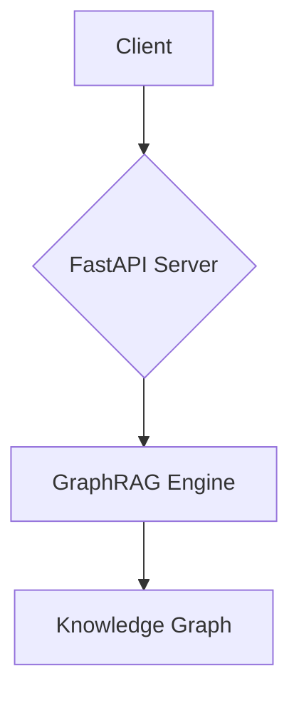

# graphrag-api

A FastAPI-based API for the `microsoft/graphrag` library.

This project provides a robust and scalable API to interact with the `microsoft/graphrag` engine, allowing you to build applications that leverage the power of graph-based retrieval-augmented generation.

## High-Level Architecture

## Features

*   **FastAPI Backend:** A modern, fast (high-performance), web framework for building APIs with Python 3.11+ based on standard Python type hints.
*   **GraphRAG Integration:** Seamless integration with the `microsoft/graphrag` library.
*   **Scalable Architecture:** Designed to be scalable and easy to deploy.

## Getting Started

**TODO:** Add instructions on how to get started with the project.

## License

This project is licensed under the MIT License. See the `LICENSE` file for details.
