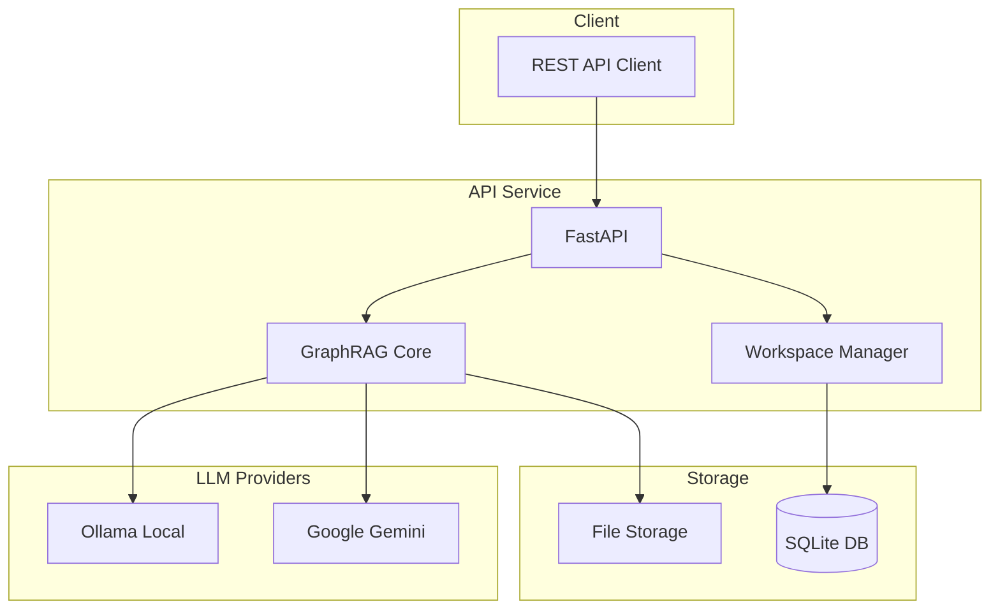

# GraphRAG API - Simple Knowledge Graph Service

[](https://opensource.org/licenses/MIT)
[](https://www.python.org/downloads/)
[](https://fastapi.tiangolo.com/)
[](https://www.docker.com/)
[](https://cloud.google.com/run)

**Simplified GraphRAG API for small-scale deployments (1-5 users) with SQLite database and serverless-ready architecture.**

## Features

### Core Capabilities

- **GraphRAG Integration**: Microsoft GraphRAG library with multi-provider LLM support
- **Workspace Management**: Multiple isolated projects with custom configurations
- **Simple Database**: SQLite for zero-configuration deployment
- **Dual LLM Support**: Ollama (local) and Google Gemini (cloud)
- **REST API**: Clean FastAPI interface with automatic documentation
- **Lightweight Caching**: In-memory cache for improved performance

### Deployment Options

- **Local Development**: Docker Compose with Ollama
- **Production**: Google Cloud Run (serverless)
- **Database**: SQLite (no external database needed!)
- **Scale**: Optimized for 1-5 concurrent users

## System Architecture



## Quick Start

### Option 1: Docker (Recommended for Development)

```bash
# Clone repository
git clone https://github.com/yourusername/graphrag-api.git
cd graphrag-api

# Copy environment template
cp env.example .env

# Start with Docker Compose (includes Ollama)
docker-compose up -d

# Check health
curl http://localhost:8001/health
```

### Option 2: Local Python

```bash
# Install Poetry
pip install poetry

# Install dependencies
poetry install

# Run directly (uses SQLite, no database setup needed!)
poetry run uvicorn src.graphrag_api_service.main:app --port 8001
```

### Option 3: Google Cloud Run (Production)

```bash
# Set project ID
export PROJECT_ID=your-project-id

# Deploy to Cloud Run
./scripts/deploy-cloudrun.sh
```

## Configuration

### Minimal `.env` for Local Development

```env
# LLM Provider
LLM_PROVIDER=ollama
OLLAMA_BASE_URL=http://localhost:11434

# Database (automatic)
DATABASE_TYPE=sqlite
DATABASE_PATH=data/graphrag.db

# Security (dev only)
AUTH_ENABLED=false
```

### Minimal `.env` for Production (Cloud Run)

```env
# LLM Provider
LLM_PROVIDER=google_gemini
GOOGLE_API_KEY=your-api-key
GOOGLE_PROJECT_ID=your-project-id

# Database (automatic)
DATABASE_TYPE=sqlite
DATABASE_PATH=/tmp/graphrag.db

# Security
AUTH_ENABLED=true
JWT_SECRET_KEY=your-secure-secret-key
```

## API Usage

### Create a Workspace

```bash
curl -X POST http://localhost:8001/api/workspaces \
  -H "Content-Type: application/json" \
  -d '{
    "name": "my-project",
    "description": "My knowledge graph project",
    "data_path": "/path/to/documents"
  }'
```

### Query GraphRAG

```bash
curl -X POST http://localhost:8001/api/query \
  -H "Content-Type: application/json" \
  -d '{
    "workspace_id": "workspace-uuid",
    "query": "What are the main topics in the documents?",
    "query_type": "global"
  }'
```

### Index Documents

```bash
curl -X POST http://localhost:8001/api/index \
  -H "Content-Type: application/json" \
  -d '{
    "workspace_id": "workspace-uuid"
  }'
```

## API Documentation

Once running, visit:

- **Swagger UI**: <http://localhost:8001/docs>
- **ReDoc**: <http://localhost:8001/redoc>
- **Health Check**: <http://localhost:8001/health>

## Project Structure

```
graphrag-api/
├── src/graphrag_api_service/
│   ├── main.py                 # FastAPI application
│   ├── config.py               # Simple configuration
│   ├── database/
│   │   └── sqlite_models.py   # SQLite database
│   ├── workspace/
│   │   └── sqlite_manager.py  # Workspace management
│   ├── providers/              # LLM providers
│   │   ├── ollama_provider.py
│   │   └── gemini_provider.py
│   └── cache/
│       └── simple_cache.py    # In-memory cache
├── docker-compose.yml          # Local development
├── Dockerfile.cloudrun         # Cloud Run deployment
├── cloudbuild.yaml            # Google Cloud Build
└── env.example                # Environment template
```

## Deployment Guide

### Local Development (Windows/Mac/Linux)

1. Install Docker Desktop
2. Clone repository
3. Run `docker-compose up`
4. Access API at <http://localhost:8001>

### Google Cloud Run (Serverless)

1. Install gcloud CLI
2. Configure project: `gcloud config set project YOUR_PROJECT_ID`
3. Run deployment script: `./scripts/deploy-cloudrun.sh`
4. Access at provided Cloud Run URL

### Key Features for Small Scale

- **No PostgreSQL**: Uses SQLite for simplicity
- **No Redis**: In-memory caching only
- **No Kubernetes**: Runs on Cloud Run or Docker
- **Minimal Config**: Works with default settings
- **Low Resource**: 2GB RAM, 2 CPU cores sufficient

## Cost Estimation (Google Cloud)

For 1-5 users with moderate usage:

- **Cloud Run**: ~$5-20/month (scales to zero)
- **Gemini API**: ~$10-50/month (depends on usage)
- **Total**: ~$15-70/month

## Troubleshooting

### Common Issues

1. **Ollama not connecting**: Ensure Docker is running
2. **SQLite locked**: Limit concurrent writes
3. **Cloud Run timeout**: Increase timeout in deployment

### Support

- [Documentation](docs/DEPLOYMENT_GUIDE.md)
- [GitHub Issues](https://github.com/yourusername/graphrag-api/issues)

## Development

```bash
# Run tests
poetry run pytest

# Format code
poetry run black src/ tests/

# Lint code
poetry run ruff check src/ tests/

# Type check
poetry run mypy src/graphrag_api_service
```

## License

MIT License - See [LICENSE](LICENSE) file for details.

## Acknowledgments

- Built on [Microsoft GraphRAG](https://github.com/microsoft/graphrag)
- Powered by [FastAPI](https://fastapi.tiangolo.com/)
- LLM support via [Ollama](https://ollama.ai/) and [Google Gemini](https://gemini.google.com/)
