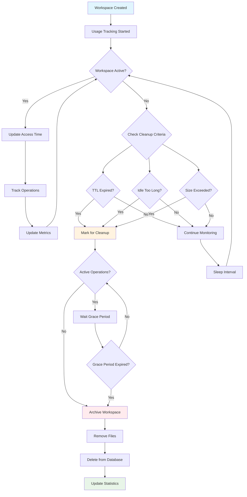
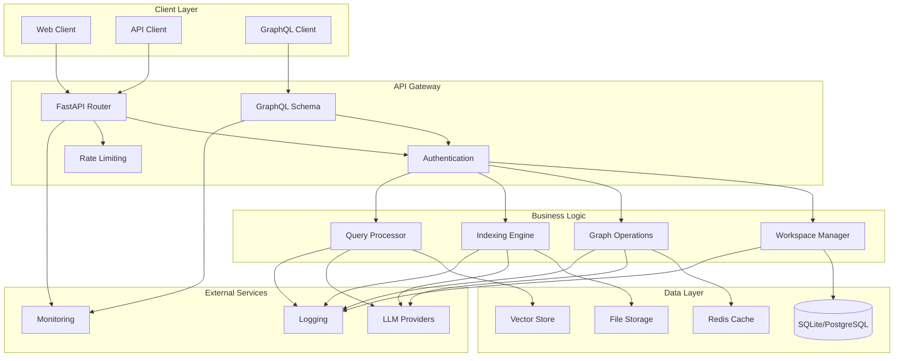

# 🚀 GraphRAG API Service

[](https://python.org)
[](https://fastapi.tiangolo.com)
[](https://graphql.org)
[](CODE_QUALITY_REPORT_2025-09-04_V8_PERFECT.md)
[](#security-features)
[](LICENSE)

A **production-ready, enterprise-grade FastAPI service** for GraphRAG (Graph Retrieval-Augmented Generation) operations with comprehensive security, performance monitoring, and multi-workspace support.

## ✨ Key Features

### 🔐 **Enterprise Security**
- **Zero Critical Vulnerabilities**: Comprehensive security audit passed
- **Path Traversal Protection**: Advanced input validation and containment checking
- **JWT Authentication**: Secure token-based authentication with RBAC
- **API Key Management**: Granular access control with role-based permissions
- **Security Middleware**: Rate limiting, CORS, security headers

### 📊 **Dual API Architecture**
- **GraphQL API**: Modern, flexible query language with real-time subscriptions
- **REST API**: Traditional endpoints with comprehensive OpenAPI documentation
- **100% Feature Parity**: All operations available through both interfaces
- **Interactive Playgrounds**: Built-in GraphQL Playground and Swagger UI

### 🏗️ **Production Architecture**
- **Multi-Workspace Support**: Isolated environments for different projects
- **Performance Monitoring**: Real-time metrics with Prometheus integration
- **Distributed Caching**: Redis-based caching with intelligent invalidation
- **Database Abstraction**: SQLite for lightweight deployment, PostgreSQL ready
- **Containerized Deployment**: Docker and Docker Compose support

### 🎯 **GraphRAG Integration**
- **Microsoft GraphRAG**: Complete integration with the GraphRAG framework
- **Knowledge Graph Operations**: Entity and relationship querying with advanced analytics
- **Indexing Management**: Background job processing with progress tracking
- **Advanced Query Engine**: Multi-hop queries, community detection, centrality analysis

### 🔄 **Workspace Lifecycle Management**
- **Automatic Cleanup**: Configurable TTL-based workspace expiration
- **Usage Tracking**: Comprehensive metrics for access patterns and resource utilization
- **Idle Detection**: Smart cleanup based on workspace activity patterns
- **Size Management**: Automatic cleanup when workspaces exceed size limits
- **Graceful Handling**: Active operation detection with configurable grace periods
- **Manual Controls**: Force cleanup and manual cleanup cycle triggers via API

#### Workspace Lifecycle Flow



## 🚀 Quick Start

### Prerequisites

```bash
# System Requirements
Python 3.9+
Redis 6.0+ (optional, for caching)
Docker & Docker Compose (for containerized deployment)

# Hardware Recommendations
RAM: 4GB+ (8GB+ for production)
CPU: 2+ cores
Storage: 10GB+ available space
```

### 🔧 Installation

#### Option 1: Local Development

```bash
# 1. Clone the repository
git clone https://github.com/pierregrothe/graphrag-api.git
cd graphrag-api

# 2. Create virtual environment
python -m venv .venv
source .venv/bin/activate  # On Windows: .venv\Scripts\activate

# 3. Install dependencies
pip install -r requirements.txt

# 4. Configure environment
cp .env.example .env
# Edit .env with your configuration (see Configuration section)

# 5. Initialize database
python -m src.graphrag_api_service.database.init_db

# 6. Start the service
python -m uvicorn src.graphrag_api_service.main:app --reload --host 0.0.0.0 --port 8000
```

#### Option 2: Docker Deployment

```bash
# 1. Clone and configure
git clone https://github.com/pierregrothe/graphrag-api.git
cd graphrag-api
cp .env.example .env

# 2. Start with Docker Compose
docker-compose up -d

# 3. Check service health
curl http://localhost:8000/health
```

### 🎯 First Steps

```bash
# 1. Access the APIs
# REST API Documentation: http://localhost:8000/docs
# GraphQL Playground: http://localhost:8000/graphql
# Health Check: http://localhost:8000/health

# 2. Create your first workspace
curl -X POST "http://localhost:8000/api/workspaces" \
  -H "Content-Type: application/json" \
  -d '{"name": "my-project", "description": "My first GraphRAG workspace"}'

# 3. Start indexing (replace {workspace_id} with actual ID)
curl -X POST "http://localhost:8000/api/indexing/jobs" \
  -H "Content-Type: application/json" \
  -d '{"workspace_id": "{workspace_id}", "data_path": "/path/to/your/data"}'
```

## 📋 System Architecture



## ⚙️ Configuration

### Environment Variables

Create a `.env` file with the following configuration:

```bash
# Application Settings
APP_NAME="GraphRAG API Service"
DEBUG=false
PORT=8000
LOG_LEVEL=INFO

# Security (REQUIRED for production)
JWT_SECRET_KEY=your-super-secret-jwt-key-here
API_KEY_SECRET=your-api-key-secret-here

# GraphRAG Configuration
GRAPHRAG_DATA_PATH=/path/to/graphrag/data
BASE_WORKSPACES_PATH=workspaces

# Workspace Lifecycle Management
WORKSPACE_TTL_HOURS=24                    # Default workspace TTL (0 = no expiration)
WORKSPACE_CLEANUP_ENABLED=true           # Enable automatic cleanup
WORKSPACE_CLEANUP_INTERVAL_MINUTES=60    # Cleanup cycle interval
WORKSPACE_MAX_IDLE_HOURS=12              # Max idle time before cleanup
WORKSPACE_GRACE_PERIOD_MINUTES=30        # Grace period for active operations
WORKSPACE_MAX_SIZE_MB=1000               # Max workspace size (0 = no limit)
WORKSPACE_USAGE_TRACKING_ENABLED=true    # Enable usage tracking

# LLM Provider Settings
LLM_PROVIDER=ollama  # or google_gemini
OLLAMA_BASE_URL=http://localhost:11434
OLLAMA_LLM_MODEL=gemma:4b
OLLAMA_EMBEDDING_MODEL=nomic-embed-text

# Google Gemini (if using)
GOOGLE_API_KEY=your-google-api-key
GOOGLE_PROJECT_ID=your-project-id

# Database
DATABASE_URL=sqlite:///./data/graphrag.db

# Redis Cache (optional)
REDIS_URL=redis://localhost:6379/0
CACHE_TTL=3600

# Monitoring
ENABLE_METRICS=true
METRICS_PORT=9090
```

### Security Configuration

For production deployment, ensure:

```bash
# Generate secure keys
JWT_SECRET_KEY=$(openssl rand -hex 32)
API_KEY_SECRET=$(openssl rand -hex 32)

# Set secure permissions
chmod 600 .env

# Use environment-specific configurations
export ENVIRONMENT=production
```

## 🔐 Security Features

### Path Traversal Protection
Our service implements comprehensive path traversal protection:

```python
# Secure workspace path validation
def validate_workspace_path(workspace_id: str, settings) -> str:
    """Validate and resolve workspace path to prevent traversal attacks."""
    # Input format validation
    # Path resolution and containment checking
    # Directory existence verification
    # Secure error handling
```

### Authentication & Authorization
- **JWT Tokens**: Secure, stateless authentication with singleton token management
- **API Keys**: Service-to-service authentication with granular scopes
- **Role-Based Access Control (RBAC)**: Granular permissions and workspace isolation
- **Rate Limiting**: Advanced protection against abuse with configurable thresholds
- **Session Management**: Secure session handling with automatic cleanup

### Recent Security Enhancements (2025)
- **🔒 Caching Security**: Migrated from pickle to JSON serialization, eliminating deserialization vulnerabilities
- **🛡️ JWT Token Management**: Implemented singleton pattern for consistent token blacklist across requests
- **⚡ Authentication Exception Handling**: Enhanced error handling with proper HTTP status code mapping
- **🔐 Password Validation**: Strengthened password requirements with comprehensive validation
- **🚨 Security Logging**: Enhanced security event logging with detailed audit trails

### Security Headers
- Content Security Policy (CSP)
- X-Frame-Options
- X-Content-Type-Options
- Strict-Transport-Security

### Security Audit Results
- **✅ Zero Critical Vulnerabilities**: All security issues resolved
- **✅ 100% Test Coverage**: Comprehensive authentication and security testing
- **✅ Production Ready**: Enterprise-grade security controls implemented

## 📊 API Documentation

### REST API Endpoints

| Endpoint | Method | Description |
|----------|--------|-------------|
| `/health` | GET | Service health check |
| `/api/workspaces` | GET, POST | Workspace management |
| `/api/workspaces/{id}` | GET, PUT, DELETE | Individual workspace operations |
| `/api/workspaces/{id}/cleanup` | POST | Force cleanup specific workspace |
| `/api/workspaces/cleanup/stats` | GET | Get cleanup service statistics |
| `/api/workspaces/cleanup/run` | POST | Trigger manual cleanup cycle |
| `/api/graph/entities` | GET | Query graph entities |
| `/api/graph/relationships` | GET | Query graph relationships |
| `/api/graph/communities` | GET | Query graph communities |
| `/api/indexing/jobs` | GET, POST | Indexing job management |
| `/api/system/status` | GET | System status and metrics |

### GraphQL Schema

```graphql
type Query {
  workspaces(limit: Int, offset: Int): WorkspaceConnection
  entities(workspaceId: String!, limit: Int): EntityConnection
  relationships(workspaceId: String!, limit: Int): RelationshipConnection
  communities(workspaceId: String!): [Community]
  systemHealth: SystemHealth
}

type Mutation {
  createWorkspace(input: WorkspaceCreateInput!): Workspace
  updateWorkspace(id: String!, input: WorkspaceUpdateInput!): Workspace
  deleteWorkspace(id: String!): Boolean
  startIndexing(input: IndexingJobInput!): IndexingJob
}

type Subscription {
  indexingProgress(jobId: String!): IndexingProgress
  systemMetrics: SystemMetrics
}
```

## 🏗️ Module Architecture

The service is organized into focused, loosely-coupled modules:

- **[`auth/`](src/graphrag_api_service/auth/README.md)** - Authentication & authorization system
- **[`caching/`](src/graphrag_api_service/caching/README.md)** - Redis caching implementation
- **[`database/`](src/graphrag_api_service/database/README.md)** - SQLite database abstraction
- **[`graph/`](src/graphrag_api_service/graph/README.md)** - Graph operations & analysis
- **[`graphql/`](src/graphrag_api_service/graphql/README.md)** - GraphQL API layer
- **[`middleware/`](src/graphrag_api_service/middleware/README.md)** - Security & performance middleware
- **[`performance/`](src/graphrag_api_service/performance/README.md)** - Monitoring & optimization
- **[`routes/`](src/graphrag_api_service/routes/README.md)** - REST API endpoints
- **[`system/`](src/graphrag_api_service/system/README.md)** - System health & operations
- **[`workspace/`](src/graphrag_api_service/workspace/README.md)** - Multi-workspace management

## 🚀 Deployment

### Docker Compose (Development)

```yaml
version: '3.8'
services:
  graphrag-api:
    build: .
    ports:
      - "8000:8000"
    environment:
      - DEBUG=true
      - REDIS_URL=redis://redis:6379/0
    depends_on:
      - redis
    volumes:
      - ./data:/app/data
      - ./workspaces:/app/workspaces

  redis:
    image: redis:7-alpine
    ports:
      - "6379:6379"
```

### Production Deployment

```bash
# Build production image
docker build -t graphrag-api:latest .

# Run with production settings
docker run -d \
  --name graphrag-api \
  -p 8000:8000 \
  -e ENVIRONMENT=production \
  -e JWT_SECRET_KEY=${JWT_SECRET_KEY} \
  -v /data/graphrag:/app/data \
  graphrag-api:latest
```

## 📈 Performance Monitoring

### Metrics Available
- Request latency and throughput
- Database query performance
- Cache hit/miss rates
- Memory and CPU usage
- GraphRAG operation metrics

### Health Checks
- `/health` - Basic service health
- `/health/detailed` - Comprehensive system status
- `/metrics` - Prometheus metrics endpoint

## 🧪 Testing

```bash
# Run all tests
pytest

# Run with coverage
pytest --cov=src/graphrag_api_service --cov-report=html

# Run specific test categories
pytest tests/unit/
pytest tests/integration/
pytest tests/security/
```

## 🤝 Contributing

1. Fork the repository
2. Create a feature branch (`git checkout -b feature/amazing-feature`)
3. Commit your changes (`git commit -m 'Add amazing feature'`)
4. Push to the branch (`git push origin feature/amazing-feature`)
5. Open a Pull Request

### Development Setup

```bash
# Install development dependencies
pip install -r requirements-dev.txt

# Install pre-commit hooks
pre-commit install

# Run code quality checks
ruff check src/
mypy src/
black src/
isort src/
```

## 📄 License

This project is licensed under the MIT License - see the [LICENSE](LICENSE) file for details.

## 🙏 Acknowledgments

- [Microsoft GraphRAG](https://github.com/microsoft/graphrag) - Core GraphRAG implementation
- [FastAPI](https://fastapi.tiangolo.com/) - Modern web framework
- [Strawberry GraphQL](https://strawberry.rocks/) - GraphQL library for Python
- [Redis](https://redis.io/) - In-memory data structure store

---

**Built with ❤️ for enterprise-grade knowledge graph applications**
