# GraphRAG API Service

A FastAPI-based API service for Microsoft GraphRAG with multi-provider LLM support.

This project provides a robust and scalable API to interact with the Microsoft GraphRAG engine, supporting both
local (Ollama) and cloud-based (Google Gemini) language models for flexible deployment scenarios.

## Architecture

### Multi-Provider LLM Support


## Key Features

### Core Capabilities

- **FastAPI Backend**: High-performance async web framework with automatic OpenAPI documentation
- **GraphRAG Integration**: Complete Microsoft GraphRAG implementation for graph-based RAG
- **Multi-Provider Architecture**: Unified abstraction layer with factory pattern for LLM provider switching
- **Provider Abstraction**: Abstract base classes for consistent interface across all providers

### LLM Provider Support

- **Local Ollama**: Privacy-focused local deployment with Gemma3:4b
    - No external API costs
    - Complete data privacy
    - Local embeddings with nomic-embed-text
    - Direct integration without proxy layers

- **Google Cloud Gemini**: Cloud-based high-performance deployment
    - Latest Gemini models (2.5-flash, 2.5-pro)
    - Enterprise-grade reliability and scaling
    - Advanced multimodal capabilities
    - Support for both Google Cloud API and Vertex AI endpoints
    - Flexible authentication (API keys or Application Default Credentials)

### GraphRAG Operations

- **Indexing**: Background processing for document ingestion and knowledge graph creation
- **Querying**: Global and local search modes with configurable community levels
- **Workspace Management**: Multi-project support with isolated configurations
- **Real-time Status**: Progress tracking and health monitoring

## System Flow Diagrams

### Request Processing Sequence

```mermaid
sequenceDiagram
    participant Client as 📱 Client App
    participant API as ⚡ FastAPI Server
    participant Auth as 🔐 Auth Handler
    participant Factory as 🔄 Provider Factory
    participant Ollama as 🏠 Ollama Provider
    participant Gemini as ☁️ Gemini Provider
    participant Engine as 🧠 GraphRAG Engine
    participant Storage as 📊 Knowledge Graph

    rect rgb(230, 245, 255)
        Note over Client,Storage: Authentication & Request Validation
        Client->>+API: POST /graphrag/query
        API->>+Auth: Validate API Key
        Auth-->>-API: Authentication Success
    end

    rect rgb(255, 243, 224)
        Note over API,Factory: Provider Selection & Configuration
        API->>+Factory: Get Active Provider
        Factory->>Factory: Load Configuration
        Factory->>Factory: Health Check Providers

        alt Ollama Provider Selected
            Factory->>+Ollama: Initialize Connection
            Ollama->>Ollama: Check Models Available
            Ollama-->>-Factory: Ready ✅
        else Gemini Provider Selected
            Factory->>+Gemini: Initialize Connection
            Gemini->>Gemini: Validate API Key/ADC
            Gemini-->>-Factory: Ready ✅
        end

        Factory-->>-API: Provider Instance
    end

    rect rgb(232, 245, 233)
        Note over API,Engine: Query Processing & Response Generation
        API->>+Engine: Process Query Request
        Engine->>+Storage: Retrieve Context
        Storage-->>-Engine: Vector + Graph Data

        alt Using Ollama
            Engine->>+Ollama: Generate Response
            Ollama->>Ollama: Local LLM Processing
            Ollama-->>-Engine: Generated Text
        else Using Gemini
            Engine->>+Gemini: Generate Response
            Gemini->>Gemini: Cloud LLM Processing
            Gemini-->>-Engine: Generated Text
        end

        Engine->>Engine: Combine Context + Response
        Engine-->>-API: Final Answer
    end

    rect rgb(252, 228, 236)
        Note over API,Client: Response & Caching
        API->>Storage: Cache Response (Optional)
        API-->>-Client: JSON Response with Answer
    end
```



### Provider State Management


### Developer Experience

- **Code Quality**: Black formatting + Ruff linting + mypy type checking with 100% clean pipeline
- **Type Safety**: Complete static type analysis with zero type errors in production code
- **Documentation Quality**: markdownlint + prettier for consistent documentation formatting
- **Configuration Management**: Environment-based settings with Pydantic validation
- **Comprehensive Testing**: pytest framework with 65 tests across all components
- **Quality Assurance**: Integrated quality pipeline catching errors before runtime
- **Development Workflow**: Auto-generated API docs and comprehensive project documentation
- **Windows Compatibility**: No emoji usage in code to prevent Unicode encoding errors

## Getting Started

### Prerequisites

- **Python 3.12**: Project uses Python 3.12 specifically
- **Poetry**: For dependency management
- **Provider Setup**: Either Ollama (local) or Google Cloud credentials

### Installation

1. **Clone the repository:**

    ```bash
    git clone https://github.com/pierregrothe/graphrag-api.git
    cd graphrag-api
    ```

2. **Install dependencies:**

    ```bash
    poetry install
    ```

3. **Configure your LLM provider:**

    **For Ollama (Local):**

    ```bash
    # Install and start Ollama
    # Pull required models
    ollama pull gemma:4b
    ollama pull nomic-embed-text

    # Set environment variables
    export GRAPHRAG_LLM_PROVIDER=ollama
    export OLLAMA_BASE_URL=http://localhost:11434
    ```

    **For Google Gemini (Cloud):**

    ```bash
    # Standard Google Cloud API (requires API key)
    export GRAPHRAG_LLM_PROVIDER=google_gemini
    export GOOGLE_API_KEY=your_api_key
    export GOOGLE_PROJECT_ID=your_project_id

    # Optional: Use Vertex AI endpoints (no API key needed if using ADC)
    export GOOGLE_CLOUD_USE_VERTEX_AI=true
    export VERTEX_AI_LOCATION=us-central1
    export VERTEX_AI_ENDPOINT=https://custom-vertex.googleapis.com  # Optional custom endpoint
    ```

4. **Run the application:**

    ```bash
    poetry run uvicorn src.graphrag_api_service.main:app --reload
    ```

5. **Access the API:**
    - **API Documentation**: <http://localhost:8001/docs>
    - **Health Check**: <http://localhost:8001/health>
    - **GraphRAG Status**: <http://localhost:8001/graphrag/status>

## API Endpoints

### Core Endpoints

- `GET /` - API information and status
- `GET /health` - Health check
- `GET /info` - Application configuration details

### GraphRAG Endpoints

- `POST /graphrag/index` - Index documents for knowledge graph creation
- `POST /graphrag/query` - Query the knowledge graph
- `GET /graphrag/status` - Get GraphRAG system status and configuration

## Current Development Status

**Phase 2 Complete** ✅ (Provider Abstraction Layer - August 2025)

- **Multi-Provider Architecture**: Ollama (local) + Google Gemini (cloud) with Vertex AI support
- **Quality Assurance**: 100% clean code quality pipeline (Black + Ruff + mypy + markdownlint)
- **Type Safety**: Complete static type checking with zero production errors
- **Test Coverage**: 41 comprehensive tests across configuration, providers, and API endpoints
- **Documentation**: Consistent formatting and linting across all project documentation
- **Next Phase**: GraphRAG Core Implementation (indexing, querying, workspace management)

## Project Documentation

- **API Documentation**: Interactive Swagger UI documentation at `/docs`
- **ReDoc Documentation**: ReDoc API documentation at `/redoc`
- **Project Plan**: [PROJECT_PLAN.md](PROJECT_PLAN.md) - Implementation roadmap and phases
- **Development Notes**: [GEMINI.md](GEMINI.md) - Key decisions and conventions
- **Claude Code Context**: [CLAUDE.md](CLAUDE.md) - Development environment context

## License

This project is licensed under the MIT License. See the `LICENSE` file for details.
