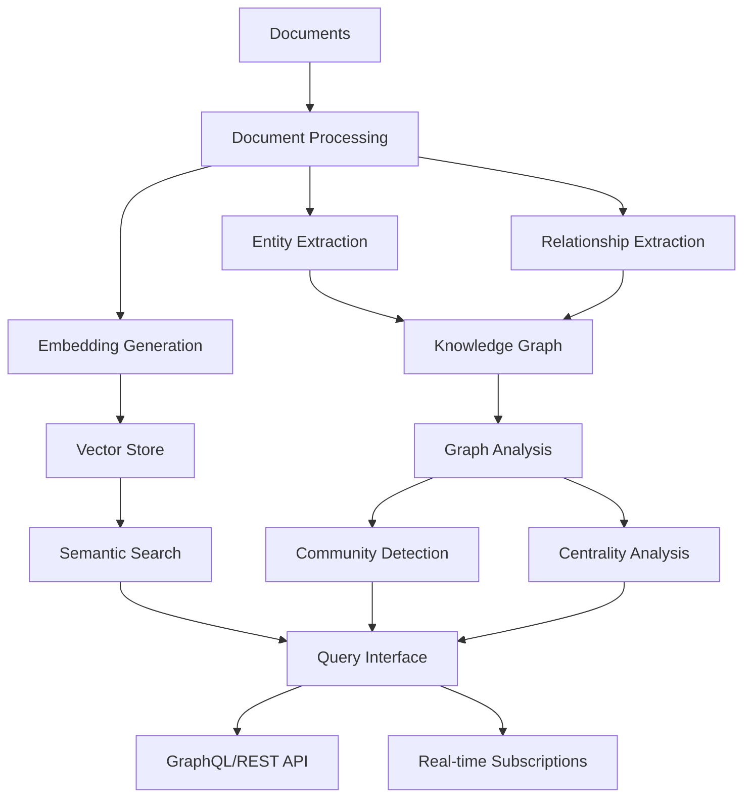

# Knowledge Base Construction with GraphRAG API

## Overview

This guide demonstrates how to build comprehensive knowledge bases using GraphRAG API, from document ingestion to advanced graph analysis. Learn to transform unstructured documents into intelligent, queryable knowledge graphs.

## Architecture Overview



## Step-by-Step Implementation

### **1. Document Preparation**

#### **Supported Document Types**
- **Text Files**: .txt, .md, .rtf
- **Office Documents**: .docx, .pdf, .pptx
- **Web Content**: HTML, XML
- **Structured Data**: JSON, CSV, YAML

#### **Document Structure Optimization**
```python
# Document preprocessing for optimal extraction
def prepare_documents(file_paths):
    """Prepare documents for GraphRAG processing"""
    documents = []
    
    for file_path in file_paths:
        # Extract text content
        content = extract_text(file_path)
        
        # Clean and normalize text
        cleaned_content = clean_text(content)
        
        # Split into chunks for processing
        chunks = chunk_text(cleaned_content, chunk_size=1000, overlap=200)
        
        # Create document objects
        for i, chunk in enumerate(chunks):
            doc = {
                "id": f"{file_path}_{i}",
                "source": file_path,
                "content": chunk,
                "metadata": {
                    "chunk_index": i,
                    "total_chunks": len(chunks),
                    "file_type": get_file_type(file_path),
                    "created_at": datetime.now().isoformat()
                }
            }
            documents.append(doc)
    
    return documents

def clean_text(text):
    """Clean and normalize text content"""
    # Remove excessive whitespace
    text = re.sub(r'\s+', ' ', text)
    
    # Fix encoding issues
    text = text.encode('utf-8', errors='ignore').decode('utf-8')
    
    # Remove special characters but keep punctuation
    text = re.sub(r'[^\w\s\.\,\!\?\;\:\-\(\)]', '', text)
    
    return text.strip()

def chunk_text(text, chunk_size=1000, overlap=200):
    """Split text into overlapping chunks"""
    words = text.split()
    chunks = []
    
    for i in range(0, len(words), chunk_size - overlap):
        chunk_words = words[i:i + chunk_size]
        chunk = ' '.join(chunk_words)
        chunks.append(chunk)
        
        if i + chunk_size >= len(words):
            break
    
    return chunks
```

### **2. Workspace Creation and Configuration**

#### **Create Workspace**
```python
import requests

# Create workspace for knowledge base
def create_knowledge_base_workspace(name, description):
    """Create a new workspace for knowledge base"""
    response = requests.post(
        "http://localhost:8000/api/workspaces",
        headers={"Authorization": "Bearer YOUR_JWT_TOKEN"},
        json={
            "name": name,
            "description": description,
            "config": {
                "chunk_size": 1000,
                "chunk_overlap": 200,
                "enable_community_detection": True,
                "enable_entity_extraction": True,
                "enable_relationship_extraction": True,
                "embedding_model": "nomic-embed-text",
                "llm_model": "llama2"
            }
        }
    )
    
    if response.status_code == 201:
        workspace = response.json()
        print(f"Created workspace: {workspace['id']}")
        return workspace
    else:
        raise Exception(f"Failed to create workspace: {response.text}")

# Example usage
workspace = create_knowledge_base_workspace(
    name="Company Knowledge Base",
    description="Comprehensive knowledge base for company documentation"
)
```

#### **Configure Processing Parameters**
```python
# Advanced configuration for different document types
processing_configs = {
    "technical_docs": {
        "chunk_size": 1500,
        "chunk_overlap": 300,
        "entity_types": ["TECHNOLOGY", "PROCESS", "TOOL", "CONCEPT"],
        "relationship_types": ["USES", "IMPLEMENTS", "DEPENDS_ON", "PART_OF"],
        "enable_code_extraction": True
    },
    "business_docs": {
        "chunk_size": 800,
        "chunk_overlap": 150,
        "entity_types": ["PERSON", "ORGANIZATION", "PRODUCT", "SERVICE"],
        "relationship_types": ["WORKS_FOR", "MANAGES", "PROVIDES", "COLLABORATES"],
        "enable_sentiment_analysis": True
    },
    "research_papers": {
        "chunk_size": 2000,
        "chunk_overlap": 400,
        "entity_types": ["RESEARCHER", "INSTITUTION", "METHODOLOGY", "FINDING"],
        "relationship_types": ["AUTHORED", "CITES", "BUILDS_ON", "CONTRADICTS"],
        "enable_citation_extraction": True
    }
}
```

### **3. Document Indexing Process**

#### **Start Indexing Job**
```python
def start_indexing_job(workspace_id, data_path, config_type="technical_docs"):
    """Start document indexing with specific configuration"""
    config = processing_configs.get(config_type, processing_configs["technical_docs"])
    
    response = requests.post(
        "http://localhost:8000/api/indexing/start",
        headers={"Authorization": "Bearer YOUR_JWT_TOKEN"},
        json={
            "workspace_id": workspace_id,
            "data_path": data_path,
            "config": config
        }
    )
    
    if response.status_code == 202:
        job = response.json()
        print(f"Started indexing job: {job['job_id']}")
        return job
    else:
        raise Exception(f"Failed to start indexing: {response.text}")

# Start indexing
job = start_indexing_job(
    workspace_id=workspace["id"],
    data_path="/data/company_docs",
    config_type="business_docs"
)
```

#### **Monitor Indexing Progress**
```python
import time

def monitor_indexing_progress(job_id, poll_interval=30):
    """Monitor indexing job progress"""
    while True:
        response = requests.get(
            f"http://localhost:8000/api/indexing/status/{job_id}",
            headers={"Authorization": "Bearer YOUR_JWT_TOKEN"}
        )
        
        if response.status_code == 200:
            status = response.json()
            
            print(f"Status: {status['status']}")
            print(f"Progress: {status['progress']:.1%}")
            print(f"Message: {status['message']}")
            
            if status["status"] in ["completed", "failed"]:
                return status
            
            time.sleep(poll_interval)
        else:
            print(f"Error checking status: {response.text}")
            break

# Monitor progress
final_status = monitor_indexing_progress(job["job_id"])
print(f"Indexing completed with status: {final_status['status']}")
```

#### **Real-time Progress with GraphQL Subscriptions**
```javascript
// WebSocket subscription for real-time indexing updates
const ws = new WebSocket('ws://localhost:8000/graphql', 'graphql-ws');

// Initialize connection
ws.send(JSON.stringify({
  type: 'connection_init',
  payload: {
    Authorization: 'Bearer YOUR_JWT_TOKEN'
  }
}));

// Subscribe to indexing updates
ws.send(JSON.stringify({
  id: '1',
  type: 'start',
  payload: {
    query: `
      subscription IndexingUpdates {
        indexingUpdates {
          workspaceId
          status
          progress
          message
          error
          entitiesProcessed
          relationshipsExtracted
          documentsProcessed
        }
      }
    `
  }
}));

// Handle updates
ws.onmessage = function(event) {
  const message = JSON.parse(event.data);
  if (message.type === 'data') {
    const update = message.payload.data.indexingUpdates;
    console.log(`Progress: ${(update.progress * 100).toFixed(1)}%`);
    console.log(`Entities: ${update.entitiesProcessed}`);
    console.log(`Relationships: ${update.relationshipsExtracted}`);
  }
};
```

### **4. Knowledge Graph Analysis**

#### **Entity Analysis**
```python
def analyze_entities(workspace_id):
    """Analyze extracted entities"""
    # Get entity statistics
    response = requests.get(
        f"http://localhost:8000/api/entities/stats",
        headers={"Authorization": "Bearer YOUR_JWT_TOKEN"},
        params={"workspace_id": workspace_id}
    )
    
    stats = response.json()
    print(f"Total entities: {stats['total_count']}")
    print(f"Entity types: {stats['type_distribution']}")
    
    # Get top entities by degree (most connected)
    response = requests.get(
        f"http://localhost:8000/api/entities",
        headers={"Authorization": "Bearer YOUR_JWT_TOKEN"},
        params={
            "workspace_id": workspace_id,
            "sort_by": "degree",
            "order": "desc",
            "limit": 20
        }
    )
    
    top_entities = response.json()["entities"]
    print("\nTop connected entities:")
    for entity in top_entities:
        print(f"- {entity['title']} ({entity['type']}): {entity['degree']} connections")
    
    return stats, top_entities

# Analyze entities
entity_stats, top_entities = analyze_entities(workspace["id"])
```

#### **Relationship Analysis**
```python
def analyze_relationships(workspace_id):
    """Analyze extracted relationships"""
    # Get relationship statistics
    response = requests.get(
        f"http://localhost:8000/api/relationships/stats",
        headers={"Authorization": "Bearer YOUR_JWT_TOKEN"},
        params={"workspace_id": workspace_id}
    )
    
    stats = response.json()
    print(f"Total relationships: {stats['total_count']}")
    print(f"Relationship types: {stats['type_distribution']}")
    
    # Get strongest relationships
    response = requests.get(
        f"http://localhost:8000/api/relationships",
        headers={"Authorization": "Bearer YOUR_JWT_TOKEN"},
        params={
            "workspace_id": workspace_id,
            "sort_by": "weight",
            "order": "desc",
            "limit": 20
        }
    )
    
    strong_relationships = response.json()["relationships"]
    print("\nStrongest relationships:")
    for rel in strong_relationships:
        print(f"- {rel['source']} → {rel['target']} ({rel['type']}): {rel['weight']:.3f}")
    
    return stats, strong_relationships

# Analyze relationships
rel_stats, strong_relationships = analyze_relationships(workspace["id"])
```

#### **Community Detection**
```python
def detect_communities(workspace_id, algorithm="leiden", resolution=1.0):
    """Detect communities in the knowledge graph"""
    response = requests.post(
        f"http://localhost:8000/api/communities/detect",
        headers={"Authorization": "Bearer YOUR_JWT_TOKEN"},
        json={
            "workspace_id": workspace_id,
            "algorithm": algorithm,
            "resolution": resolution,
            "max_levels": 3
        }
    )
    
    if response.status_code == 200:
        communities = response.json()["communities"]
        
        print(f"Detected {len(communities)} communities")
        
        # Analyze community structure
        for i, community in enumerate(communities[:10]):  # Top 10 communities
            print(f"\nCommunity {i+1}:")
            print(f"  Title: {community['title']}")
            print(f"  Size: {len(community['entity_ids'])} entities")
            print(f"  Level: {community['level']}")
            
            # Get sample entities from community
            if len(community['entity_ids']) > 0:
                sample_entities = community['entity_ids'][:5]
                print(f"  Sample entities: {', '.join(sample_entities)}")
        
        return communities
    else:
        raise Exception(f"Community detection failed: {response.text}")

# Detect communities
communities = detect_communities(workspace["id"])
```

### **5. Semantic Search Implementation**

#### **Basic Semantic Search**
```python
def semantic_search(query, workspace_id, limit=10):
    """Perform semantic search on knowledge base"""
    response = requests.post(
        "http://localhost:8000/api/graph/query",
        headers={"Authorization": "Bearer YOUR_JWT_TOKEN"},
        json={
            "query": query,
            "workspace_id": workspace_id,
            "limit": limit,
            "include_embeddings": False,
            "similarity_threshold": 0.7
        }
    )
    
    if response.status_code == 200:
        results = response.json()
        
        print(f"Found {len(results['entities'])} relevant entities")
        print(f"Found {len(results['relationships'])} relevant relationships")
        
        # Display top results
        for entity in results["entities"][:5]:
            print(f"\nEntity: {entity['title']} ({entity['type']})")
            print(f"Description: {entity['description'][:200]}...")
            print(f"Relevance: {entity.get('similarity_score', 'N/A')}")
        
        return results
    else:
        raise Exception(f"Search failed: {response.text}")

# Example searches
search_results = semantic_search(
    "machine learning algorithms",
    workspace["id"]
)

search_results = semantic_search(
    "project management processes",
    workspace["id"]
)
```

#### **Advanced Search with Filters**
```python
def advanced_search(query, workspace_id, entity_types=None, date_range=None):
    """Advanced semantic search with filters"""
    search_params = {
        "query": query,
        "workspace_id": workspace_id,
        "limit": 20,
        "include_relationships": True,
        "include_communities": True
    }
    
    if entity_types:
        search_params["entity_types"] = entity_types
    
    if date_range:
        search_params["date_range"] = date_range
    
    response = requests.post(
        "http://localhost:8000/api/graph/search/advanced",
        headers={"Authorization": "Bearer YOUR_JWT_TOKEN"},
        json=search_params
    )
    
    return response.json()

# Advanced search examples
tech_results = advanced_search(
    "artificial intelligence",
    workspace["id"],
    entity_types=["TECHNOLOGY", "CONCEPT", "TOOL"]
)

recent_results = advanced_search(
    "quarterly reports",
    workspace["id"],
    date_range={"start": "2024-01-01", "end": "2024-12-31"}
)
```

### **6. GraphQL Query Examples**

#### **Complex Knowledge Graph Queries**
```graphql
# Get comprehensive view of a topic
query TopicAnalysis($query: String!, $workspaceId: String!) {
  search(query: $query, workspaceId: $workspaceId, limit: 10) {
    entities {
      id
      title
      type
      description
      degree
      communityIds
      relationships {
        id
        source
        target
        type
        weight
        description
      }
    }
    communities {
      id
      title
      level
      entityIds
    }
    score
  }
}

# Multi-hop exploration
query ExploreConnections($startEntity: String!, $hops: Int!) {
  multiHopQuery(startEntity: $startEntity, hops: $hops) {
    paths {
      entities {
        id
        title
        type
      }
      relationships {
        id
        type
        weight
      }
      pathLength
      totalWeight
    }
    summary {
      totalPaths
      averagePathLength
      strongestConnection
    }
  }
}

# Community analysis
query CommunityInsights($communityId: String!) {
  community(id: $communityId) {
    id
    title
    level
    entities {
      id
      title
      type
      centralityScore
    }
    relationships {
      id
      source
      target
      type
      weight
    }
    metrics {
      density
      modularity
      averageClustering
    }
  }
}
```

### **7. Performance Optimization**

#### **Indexing Optimization**
```python
# Optimize indexing for large document sets
optimization_strategies = {
    "batch_processing": {
        "batch_size": 100,
        "parallel_workers": 4,
        "memory_limit": "8GB"
    },
    "chunking_strategy": {
        "adaptive_chunking": True,
        "min_chunk_size": 500,
        "max_chunk_size": 2000,
        "overlap_percentage": 0.2
    },
    "entity_extraction": {
        "confidence_threshold": 0.8,
        "max_entities_per_chunk": 50,
        "entity_deduplication": True
    },
    "relationship_extraction": {
        "max_relationships_per_chunk": 100,
        "relationship_confidence_threshold": 0.7,
        "cross_chunk_relationships": True
    }
}

def optimize_indexing_config(document_count, total_size_mb):
    """Generate optimized configuration based on dataset size"""
    if document_count > 10000 or total_size_mb > 1000:
        return {
            "chunk_size": 1500,
            "batch_size": 50,
            "parallel_workers": 8,
            "enable_incremental_indexing": True
        }
    elif document_count > 1000 or total_size_mb > 100:
        return {
            "chunk_size": 1000,
            "batch_size": 100,
            "parallel_workers": 4,
            "enable_incremental_indexing": False
        }
    else:
        return {
            "chunk_size": 800,
            "batch_size": 200,
            "parallel_workers": 2,
            "enable_incremental_indexing": False
        }
```

#### **Query Performance Optimization**
```python
# Implement caching for frequent queries
from functools import lru_cache
import hashlib

@lru_cache(maxsize=1000)
def cached_semantic_search(query_hash, workspace_id):
    """Cached semantic search for frequent queries"""
    # Implementation would call actual search API
    pass

def search_with_cache(query, workspace_id):
    """Search with intelligent caching"""
    query_hash = hashlib.md5(f"{query}:{workspace_id}".encode()).hexdigest()
    return cached_semantic_search(query_hash, workspace_id)

# Implement query optimization
def optimize_search_query(query):
    """Optimize search query for better performance"""
    # Remove stop words
    stop_words = {"the", "a", "an", "and", "or", "but", "in", "on", "at", "to", "for", "of", "with", "by"}
    words = query.lower().split()
    filtered_words = [word for word in words if word not in stop_words]
    
    # Add semantic expansion
    expanded_query = " ".join(filtered_words)
    
    return expanded_query
```

## Best Practices

### **Document Preparation**
1. **Clean and normalize** text before processing
2. **Use consistent formatting** across documents
3. **Include metadata** for better context
4. **Optimize chunk sizes** based on content type
5. **Remove duplicates** to avoid redundant processing

### **Configuration Tuning**
1. **Adjust parameters** based on document types
2. **Monitor processing performance** and optimize
3. **Use appropriate models** for your domain
4. **Enable incremental indexing** for large datasets
5. **Configure community detection** parameters

### **Query Optimization**
1. **Use specific queries** for better results
2. **Implement caching** for frequent searches
3. **Filter by entity types** when appropriate
4. **Use GraphQL** for complex, nested queries
5. **Monitor query performance** and optimize

### **Maintenance**
1. **Regular reindexing** for updated documents
2. **Monitor storage usage** and cleanup
3. **Update models** for improved performance
4. **Backup knowledge graphs** regularly
5. **Monitor system performance** and scale as needed

## Troubleshooting

### **Common Issues**
- **Slow indexing**: Reduce batch size, increase workers
- **Poor entity extraction**: Adjust confidence thresholds
- **Memory issues**: Reduce chunk size, enable streaming
- **Search quality**: Improve document preprocessing
- **Performance**: Implement caching and optimization

### **Monitoring and Debugging**
```python
# Monitor indexing performance
def monitor_indexing_performance(job_id):
    """Monitor detailed indexing performance metrics"""
    response = requests.get(
        f"http://localhost:8000/api/indexing/metrics/{job_id}",
        headers={"Authorization": "Bearer YOUR_JWT_TOKEN"}
    )
    
    metrics = response.json()
    print(f"Processing rate: {metrics['documents_per_minute']} docs/min")
    print(f"Entity extraction rate: {metrics['entities_per_minute']} entities/min")
    print(f"Memory usage: {metrics['memory_usage_mb']} MB")
    print(f"Error rate: {metrics['error_rate']:.2%}")
    
    return metrics
```
