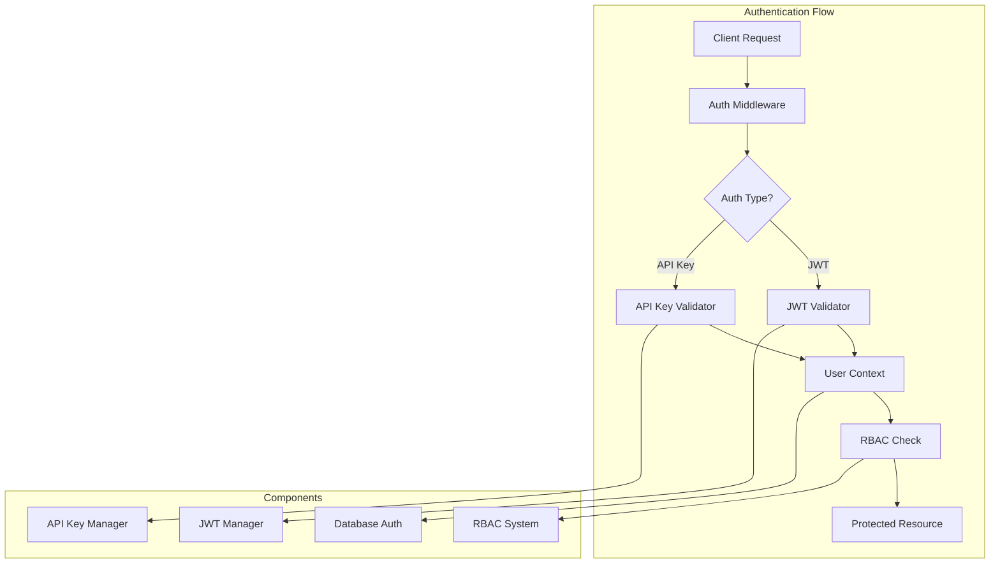

# 🔐 Authentication & Authorization Module

The authentication module provides enterprise-grade security features including JWT authentication with refresh token rotation, API key management with granular scoping, role-based access control (RBAC), rate limiting, session management, and comprehensive security logging.

## 🏗️ Architecture



## 📁 Module Structure

```
auth/
├── __init__.py              # Module exports
├── api_keys.py             # Enhanced API key management with scoping
├── database_auth.py        # Database authentication service
├── jwt_auth.py            # Enhanced JWT with refresh token rotation
├── rate_limiting.py        # Comprehensive rate limiting system
├── session_manager.py      # Session management and tracking
├── unified_auth.py         # Unified authentication middleware
├── master_key.py           # Master key management and validation
├── admin_api_keys.py       # Administrative API key management
└── README.md              # This documentation
```

## 🚀 Enhanced Features

### **New in This Version**

- **🔄 Refresh Token Rotation**: Automatic refresh token rotation for enhanced security
- **🎯 API Key Scoping**: Granular permission scoping for API keys with workspace isolation
- **⚡ Rate Limiting**: Comprehensive rate limiting with fixed window, sliding window, and token bucket strategies
- **📊 Session Management**: Advanced session tracking with concurrent limits and device monitoring
- **🛡️ Unified Authentication**: Single middleware supporting both JWT and API key authentication
- **📝 Security Logging**: Comprehensive security event logging integrated with SecurityLogger
- **🔒 Enhanced Security**: Token blacklisting, suspicious activity detection, and audit trails
- **🔑 Master Key Management**: Administrative master key system with comprehensive audit logging
- **👑 Administrative API**: Complete administrative API for managing all user API keys

## 🔑 Core Components

### JWT Authentication (`jwt_auth.py`)

Provides secure JWT token-based authentication with configurable expiration and refresh capabilities.

```python
from graphrag_api_service.auth.jwt_auth import JWTManager, JWTConfig

# Initialize JWT manager
jwt_config = JWTConfig(
    secret_key="your-secret-key",
    algorithm="HS256",
    access_token_expire_minutes=30,
    refresh_token_expire_days=7
)
jwt_manager = JWTManager(jwt_config)

# Create tokens
access_token = jwt_manager.create_access_token(
    data={"sub": "user@example.com", "role": "admin"}
)
refresh_token = jwt_manager.create_refresh_token(
    data={"sub": "user@example.com"}
)

# Validate tokens
try:
    payload = jwt_manager.verify_token(access_token)
    user_id = payload["sub"]
    role = payload["role"]
except JWTError:
    # Handle invalid token
    pass
```

**Key Features:**

- Secure token generation with configurable algorithms
- Automatic expiration handling
- Refresh token support
- Role and permission embedding
- Token blacklisting support

### API Key Management (`api_keys.py`)

Manages API keys for service-to-service authentication with role-based permissions.

```python
from graphrag_api_service.auth.api_keys import APIKeyManager

# Initialize API key manager
api_key_manager = APIKeyManager()

# Create API key
api_key_data = api_key_manager.create_api_key(
    name="Service Integration",
    permissions=["read:workspaces", "write:indexing"],
    expires_in_days=90
)

# Validate API key
try:
    key_info = api_key_manager.validate_api_key(api_key_data["key"])
    permissions = key_info["permissions"]
    is_active = key_info["is_active"]
except ValueError:
    # Handle invalid API key
    pass
```

**Key Features:**

- Secure key generation with prefixes
- Permission-based access control
- Expiration date management
- Usage tracking and rate limiting
- Key rotation support

### Database Authentication (`database_auth.py`)

Provides user management and authentication against the database with password hashing and user roles.

```python
from graphrag_api_service.auth.database_auth import DatabaseAuthService

# Initialize auth service
auth_service = DatabaseAuthService(db_session)

# Create user
user = auth_service.create_user(
    email="user@example.com",
    password="secure_password",
    full_name="John Doe",
    roles=["user", "workspace_admin"]
)

# Authenticate user
authenticated_user = auth_service.authenticate_user(
    email="user@example.com",
    password="secure_password"
)

if authenticated_user:
    # Generate JWT token
    token = jwt_manager.create_access_token(
        data={"sub": authenticated_user.email, "roles": authenticated_user.roles}
    )
```

**Key Features:**

- Secure password hashing with bcrypt
- User role management
- Account activation/deactivation
- Password reset functionality
- Audit logging

### Role-Based Access Control (`jwt_auth.py`)

Implements fine-grained permission system with role hierarchies.

```python
from graphrag_api_service.auth.jwt_auth import RoleBasedAccessControl

# Initialize RBAC
rbac = RoleBasedAccessControl()

# Define roles and permissions
rbac.add_role("admin", [
    "read:*", "write:*", "delete:*", "manage:users"
])
rbac.add_role("workspace_admin", [
    "read:workspaces", "write:workspaces", "manage:indexing"
])
rbac.add_role("user", [
    "read:workspaces", "read:entities", "read:relationships"
])

# Check permissions
user_roles = ["workspace_admin"]
if rbac.has_permission(user_roles, "write:workspaces"):
    # Allow operation
    pass
```

**Permission Patterns:**

- `read:workspaces` - Read workspace data
- `write:workspaces` - Create/update workspaces
- `delete:workspaces` - Delete workspaces
- `manage:indexing` - Control indexing operations
- `read:entities` - Query graph entities
- `read:relationships` - Query graph relationships
- `manage:users` - User administration
- `admin:*` - Full administrative access

### Master Key Management (`master_key.py`)

Provides master key validation and administrative capabilities that extend the existing authentication infrastructure.

```python
from src.graphrag_api_service.auth.master_key import (
    get_master_key_validator,
    get_admin_audit_logger
)

# Validate master key
validator = get_master_key_validator()
is_valid = validator.validate_master_key(provided_key)

# Get master key information
key_info = validator.get_master_key_info()
permissions = validator.get_master_permissions()

# Generate new master key for rotation
new_key = validator.generate_new_master_key()

# Audit logging
audit_logger = get_admin_audit_logger()
audit_logger.log_admin_operation(
    operation_id="op_123",
    admin_user_id="master_admin",
    operation_type="create_key",
    affected_resources=["key_456"],
    success=True
)
```

**Key Features:**

- **Secure Validation**: Constant-time comparison to prevent timing attacks
- **Comprehensive Permissions**: Master key has all system permissions
- **Usage Tracking**: Detailed usage statistics and last access tracking
- **Key Rotation**: Support for generating new master keys
- **Audit Logging**: Complete audit trail for all administrative operations
- **Security Integration**: Full integration with SecurityLogger system

### Administrative API Key Manager (`admin_api_keys.py`)

Comprehensive administrative capabilities for managing API keys across all users with proper auditing and batch operations.

```python
from src.graphrag_api_service.auth.admin_api_keys import (
    get_admin_api_key_manager,
    AdminAPIKeyRequest,
    AdminAPIKeyFilter,
    BatchOperation
)

# Get admin manager
admin_manager = get_admin_api_key_manager()

# List all keys with filtering
filters = AdminAPIKeyFilter(user_id="user_123", status="active")
keys, total = await admin_manager.list_all_keys(filters=filters)

# Create key for any user
request = AdminAPIKeyRequest(
    name="Admin Created Key",
    user_id="target_user",
    scopes=[APIKeyScope.READ_WORKSPACES],
    created_by="master_admin"
)
response = await admin_manager.create_admin_key(request)

# Batch operations
batch_request = BatchOperation(
    operation="revoke",
    filters=AdminAPIKeyFilter(user_id="user_123"),
    reason="Security cleanup"
)
result = await admin_manager.batch_operation(batch_request)
```

**Key Features:**

- **Cross-User Management**: Create and manage keys for any user
- **Advanced Filtering**: Filter by user, workspace, status, dates, usage patterns
- **Batch Operations**: Revoke, update, or rotate multiple keys atomically
- **Comprehensive Auditing**: Every operation logged with before/after states
- **Transaction Support**: Batch operations with rollback capability
- **Usage Analytics**: Detailed usage statistics and security insights

## 🔧 Configuration

### Environment Variables

```bash
# JWT Configuration
JWT_SECRET_KEY=your-super-secret-jwt-key-here
JWT_ALGORITHM=HS256
JWT_ACCESS_TOKEN_EXPIRE_MINUTES=30
JWT_REFRESH_TOKEN_EXPIRE_DAYS=7

# API Key Configuration
API_KEY_SECRET=your-api-key-secret-here

# Master Key Configuration (Administrative Access)
MASTER_API_KEY=grak_master_your-64-character-master-key-with-high-entropy-here
API_KEY_PREFIX=grag_
API_KEY_LENGTH=32

# Password Security
PASSWORD_MIN_LENGTH=8
PASSWORD_REQUIRE_UPPERCASE=true
PASSWORD_REQUIRE_LOWERCASE=true
PASSWORD_REQUIRE_NUMBERS=true
PASSWORD_REQUIRE_SYMBOLS=true

# Rate Limiting
AUTH_RATE_LIMIT_REQUESTS=10
AUTH_RATE_LIMIT_WINDOW=60
```

### Security Best Practices

1. **Secret Key Management**

   ```bash
   # Generate secure keys
   JWT_SECRET_KEY=$(openssl rand -hex 32)
   API_KEY_SECRET=$(openssl rand -hex 32)

   # Generate master key (64+ characters with high entropy)
   MASTER_API_KEY="grak_master_$(openssl rand -base64 48 | tr -d '=+/' | cut -c1-52)"
   ```

2. **Token Expiration**
   - Access tokens: 15-30 minutes
   - Refresh tokens: 7-30 days
   - API keys: 90 days maximum

3. **Password Policies**
   - Minimum 8 characters
   - Mixed case requirements
   - Number and symbol requirements
   - Password history tracking

## 🛡️ Security Features

### Token Security

- **Secure Generation**: Cryptographically secure random tokens
- **Expiration Handling**: Automatic token expiration
- **Blacklisting**: Revoked token tracking
- **Refresh Rotation**: Secure token refresh mechanism

### Password Security

- **bcrypt Hashing**: Industry-standard password hashing
- **Salt Generation**: Unique salt per password
- **Timing Attack Protection**: Constant-time comparisons
- **Password Policies**: Configurable complexity requirements

### API Key Security

- **Prefix Identification**: Easy key identification
- **Secure Storage**: Hashed key storage
- **Permission Scoping**: Granular permission control
- **Usage Tracking**: Audit trail for key usage

## 🔌 Integration Examples

### FastAPI Dependency

```python
from fastapi import Depends, HTTPException, status
from fastapi.security import HTTPBearer
from graphrag_api_service.auth.jwt_auth import JWTManager

security = HTTPBearer()
jwt_manager = JWTManager()

async def get_current_user(token: str = Depends(security)):
    try:
        payload = jwt_manager.verify_token(token.credentials)
        return payload
    except JWTError:
        raise HTTPException(
            status_code=status.HTTP_401_UNAUTHORIZED,
            detail="Invalid authentication credentials"
        )

async def require_permission(permission: str):
    def permission_checker(current_user = Depends(get_current_user)):
        if not rbac.has_permission(current_user.get("roles", []), permission):
            raise HTTPException(
                status_code=status.HTTP_403_FORBIDDEN,
                detail="Insufficient permissions"
            )
        return current_user
    return permission_checker

# Usage in routes
@app.get("/api/workspaces")
async def get_workspaces(
    current_user = Depends(require_permission("read:workspaces"))
):
    # Protected endpoint logic
    pass
```

### GraphQL Integration

```python
import strawberry
from strawberry.types import Info
from graphrag_api_service.auth.jwt_auth import get_current_user_from_context

@strawberry.type
class Query:
    @strawberry.field
    async def workspaces(self, info: Info) -> List[Workspace]:
        current_user = await get_current_user_from_context(info.context)
        if not rbac.has_permission(current_user.get("roles", []), "read:workspaces"):
            raise PermissionError("Insufficient permissions")

        # Query logic
        return workspaces
```

## 🧪 Testing

### Unit Tests

```python
import pytest
from graphrag_api_service.auth.jwt_auth import JWTManager, JWTConfig

def test_jwt_token_creation():
    config = JWTConfig(secret_key="test-key")
    manager = JWTManager(config)

    token = manager.create_access_token({"sub": "test@example.com"})
    assert token is not None

    payload = manager.verify_token(token)
    assert payload["sub"] == "test@example.com"

def test_api_key_validation():
    manager = APIKeyManager()

    key_data = manager.create_api_key("test-key", ["read:workspaces"])
    assert manager.validate_api_key(key_data["key"]) is not None

    with pytest.raises(ValueError):
        manager.validate_api_key("invalid-key")
```

### Integration Tests

```python
def test_protected_endpoint_access(client, auth_headers):
    response = client.get("/api/workspaces", headers=auth_headers)
    assert response.status_code == 200

def test_unauthorized_access(client):
    response = client.get("/api/workspaces")
    assert response.status_code == 401

def test_insufficient_permissions(client, user_auth_headers):
    response = client.delete("/api/workspaces/123", headers=user_auth_headers)
    assert response.status_code == 403
```

## 🚨 Security Considerations

1. **Secret Management**: Never commit secrets to version control
2. **Token Storage**: Store tokens securely on client side
3. **HTTPS Only**: Always use HTTPS in production
4. **Rate Limiting**: Implement authentication rate limiting
5. **Audit Logging**: Log all authentication events
6. **Regular Rotation**: Rotate secrets regularly
7. **Principle of Least Privilege**: Grant minimum required permissions

## 📊 Monitoring & Metrics

The authentication module provides metrics for:

- Authentication success/failure rates
- Token generation and validation counts
- API key usage statistics
- Permission check frequencies
- Failed authentication attempts

Access metrics at `/metrics` endpoint when monitoring is enabled.

---

For more information, see the [main documentation](../../../README.md) or other module documentation.
