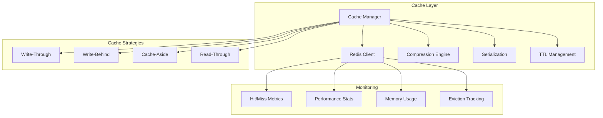

# 🚀 Caching Module

The caching module provides high-performance, distributed caching capabilities using Redis with intelligent cache invalidation, compression, and monitoring.

## 🏗️ Architecture



## 📁 Module Structure

```
caching/
├── __init__.py              # Module exports
├── redis_cache.py          # Redis caching implementation
└── README.md               # This documentation
```

## 🔧 Core Components

### Redis Cache Manager (`redis_cache.py`)

Provides a comprehensive Redis-based caching solution with advanced features.

```python
from graphrag_api_service.caching.redis_cache import RedisCacheConfig, get_redis_cache

# Initialize cache configuration
cache_config = RedisCacheConfig(
    redis_url="redis://localhost:6379/0",
    default_ttl=3600,  # 1 hour
    max_connections=20,
    enable_compression=True,
    compression_threshold=1024  # Compress data > 1KB
)

# Get cache instance
cache = get_redis_cache(cache_config)

# Basic operations
await cache.set("user:123", {"name": "John", "role": "admin"}, ttl=1800)
user_data = await cache.get("user:123")
await cache.delete("user:123")

# Batch operations
await cache.set_many({
    "workspace:1": workspace_data,
    "workspace:2": workspace_data2
}, ttl=3600)

workspaces = await cache.get_many(["workspace:1", "workspace:2"])
```

**Key Features:**
- **Automatic Serialization**: JSON, pickle, and custom serializers
- **Compression**: Automatic compression for large values
- **Connection Pooling**: Efficient connection management
- **TTL Management**: Flexible expiration policies
- **Batch Operations**: Efficient multi-key operations
- **Pattern Matching**: Wildcard key operations
- **Atomic Operations**: Transaction support

### Cache Decorators

Simplify caching with decorators for common patterns:

```python
from graphrag_api_service.caching.redis_cache import cache_result, invalidate_cache

@cache_result(ttl=1800, key_prefix="entities")
async def get_entities(workspace_id: str, limit: int = 100):
    """Cache entities query results."""
    # Expensive database operation
    return await db.query_entities(workspace_id, limit)

@invalidate_cache(patterns=["entities:*", "relationships:*"])
async def update_workspace(workspace_id: str, data: dict):
    """Invalidate related caches when workspace is updated."""
    return await db.update_workspace(workspace_id, data)

# Usage
entities = await get_entities("workspace-123")  # First call: DB query + cache
entities = await get_entities("workspace-123")  # Second call: cache hit
```

### Cache Strategies

#### 1. Cache-Aside Pattern
```python
async def get_workspace(workspace_id: str):
    # Try cache first
    cached = await cache.get(f"workspace:{workspace_id}")
    if cached:
        return cached

    # Cache miss: fetch from database
    workspace = await db.get_workspace(workspace_id)
    if workspace:
        await cache.set(f"workspace:{workspace_id}", workspace, ttl=3600)

    return workspace
```

#### 2. Write-Through Pattern
```python
async def update_workspace(workspace_id: str, data: dict):
    # Update database
    workspace = await db.update_workspace(workspace_id, data)

    # Update cache immediately
    await cache.set(f"workspace:{workspace_id}", workspace, ttl=3600)

    return workspace
```

#### 3. Write-Behind Pattern
```python
from asyncio import create_task

async def update_workspace_async(workspace_id: str, data: dict):
    # Update cache immediately
    await cache.set(f"workspace:{workspace_id}", data, ttl=3600)

    # Schedule database update
    create_task(db.update_workspace(workspace_id, data))

    return data
```

## ⚙️ Configuration

### Environment Variables

```bash
# Redis Configuration
REDIS_URL=redis://localhost:6379/0
REDIS_PASSWORD=your-redis-password
REDIS_DB=0
REDIS_MAX_CONNECTIONS=20
REDIS_SOCKET_TIMEOUT=5
REDIS_SOCKET_CONNECT_TIMEOUT=5

# Cache Settings
CACHE_DEFAULT_TTL=3600
CACHE_ENABLE_COMPRESSION=true
CACHE_COMPRESSION_THRESHOLD=1024
CACHE_COMPRESSION_LEVEL=6

# Monitoring
CACHE_ENABLE_METRICS=true
CACHE_METRICS_INTERVAL=60
```

### Advanced Configuration

```python
from graphrag_api_service.caching.redis_cache import RedisCacheConfig

config = RedisCacheConfig(
    # Connection settings
    redis_url="redis://localhost:6379/0",
    max_connections=20,
    socket_timeout=5.0,
    socket_connect_timeout=5.0,

    # Cache behavior
    default_ttl=3600,
    max_ttl=86400,  # 24 hours

    # Compression
    enable_compression=True,
    compression_threshold=1024,
    compression_level=6,

    # Serialization
    serializer="json",  # json, pickle, msgpack

    # Key management
    key_prefix="graphrag:",
    key_separator=":",

    # Performance
    pipeline_size=100,
    enable_cluster=False,

    # Monitoring
    enable_metrics=True,
    metrics_interval=60
)
```

## 🎯 Cache Key Strategies

### Hierarchical Keys
```python
# Workspace-based hierarchy
workspace_key = f"workspace:{workspace_id}"
entities_key = f"workspace:{workspace_id}:entities"
relationships_key = f"workspace:{workspace_id}:relationships"

# Query-based keys
query_key = f"query:{hash(query_string)}:{workspace_id}"
search_key = f"search:{search_term}:{workspace_id}:{limit}:{offset}"
```

### Cache Tags
```python
# Tag-based invalidation
await cache.set_with_tags(
    key="entities:workspace-123",
    value=entities_data,
    tags=["workspace-123", "entities", "graph-data"],
    ttl=3600
)

# Invalidate by tags
await cache.invalidate_by_tags(["workspace-123"])  # Clear all workspace data
await cache.invalidate_by_tags(["entities"])       # Clear all entity caches
```

## 📊 Performance Optimization

### Connection Pooling
```python
# Efficient connection management
cache_config = RedisCacheConfig(
    redis_url="redis://localhost:6379/0",
    max_connections=20,
    min_connections=5,
    connection_pool_class="BlockingConnectionPool"
)
```

### Pipeline Operations
```python
# Batch operations for better performance
async def cache_multiple_workspaces(workspaces: list):
    pipeline_data = {
        f"workspace:{ws.id}": ws.to_dict()
        for ws in workspaces
    }

    await cache.set_many(pipeline_data, ttl=3600)
```

### Compression
```python
# Automatic compression for large objects
large_data = {"entities": [...], "relationships": [...]}  # > 1KB

# Automatically compressed when stored
await cache.set("large_dataset", large_data, ttl=3600)

# Automatically decompressed when retrieved
retrieved_data = await cache.get("large_dataset")
```

## 🔍 Monitoring & Metrics

### Cache Statistics
```python
# Get cache statistics
stats = await cache.get_stats()
print(f"Hit rate: {stats['hit_rate']:.2%}")
print(f"Miss rate: {stats['miss_rate']:.2%}")
print(f"Total operations: {stats['total_operations']}")
print(f"Memory usage: {stats['memory_usage_mb']} MB")
```

### Performance Metrics
- **Hit Rate**: Percentage of cache hits vs total requests
- **Miss Rate**: Percentage of cache misses vs total requests
- **Latency**: Average response time for cache operations
- **Memory Usage**: Current Redis memory consumption
- **Eviction Rate**: Rate of key evictions due to memory pressure
- **Connection Pool**: Active/idle connection statistics

### Health Checks
```python
# Cache health check
async def check_cache_health():
    try:
        # Test basic operations
        await cache.set("health_check", "ok", ttl=60)
        result = await cache.get("health_check")
        await cache.delete("health_check")

        return result == "ok"
    except Exception:
        return False
```

## 🛡️ Security Features

### Data Encryption
```python
# Enable encryption for sensitive data
cache_config = RedisCacheConfig(
    redis_url="redis://localhost:6379/0",
    enable_encryption=True,
    encryption_key="your-encryption-key"
)

# Sensitive data is automatically encrypted
await cache.set("user:sensitive", {"ssn": "123-45-6789"}, ttl=1800)
```

### Access Control
```python
# Redis AUTH and ACL support
cache_config = RedisCacheConfig(
    redis_url="redis://:password@localhost:6379/0",
    username="cache_user",  # Redis 6+ ACL
    password="secure_password"
)
```

## 🧪 Testing

### Unit Tests
```python
import pytest
from graphrag_api_service.caching.redis_cache import RedisCacheConfig, get_redis_cache

@pytest.fixture
async def cache():
    config = RedisCacheConfig(redis_url="redis://localhost:6379/1")  # Test DB
    cache = get_redis_cache(config)
    yield cache
    await cache.clear()  # Cleanup

async def test_basic_operations(cache):
    # Test set/get
    await cache.set("test_key", {"data": "value"}, ttl=60)
    result = await cache.get("test_key")
    assert result["data"] == "value"

    # Test delete
    await cache.delete("test_key")
    result = await cache.get("test_key")
    assert result is None

async def test_ttl_expiration(cache):
    await cache.set("expire_key", "value", ttl=1)
    await asyncio.sleep(2)
    result = await cache.get("expire_key")
    assert result is None
```

### Integration Tests
```python
async def test_cache_with_database(cache, db_session):
    workspace_id = "test-workspace"

    # First call: cache miss, database query
    workspace = await get_workspace_cached(workspace_id)
    assert workspace is not None

    # Second call: cache hit
    cached_workspace = await get_workspace_cached(workspace_id)
    assert cached_workspace == workspace

    # Verify cache hit
    stats = await cache.get_stats()
    assert stats["hit_rate"] > 0
```

## 🚨 Best Practices

1. **Key Naming**: Use consistent, hierarchical key naming
2. **TTL Management**: Set appropriate expiration times
3. **Memory Management**: Monitor Redis memory usage
4. **Error Handling**: Graceful degradation when cache is unavailable
5. **Cache Warming**: Pre-populate frequently accessed data
6. **Invalidation Strategy**: Clear related caches on updates
7. **Monitoring**: Track cache performance metrics
8. **Security**: Encrypt sensitive cached data

## 🔧 Troubleshooting

### Common Issues

1. **Connection Timeouts**
   ```python
   # Increase timeout values
   config = RedisCacheConfig(
       socket_timeout=10.0,
       socket_connect_timeout=10.0
   )
   ```

2. **Memory Pressure**
   ```bash
   # Monitor Redis memory
   redis-cli info memory

   # Configure eviction policy
   redis-cli config set maxmemory-policy allkeys-lru
   ```

3. **High Miss Rate**
   ```python
   # Analyze cache patterns
   stats = await cache.get_stats()
   print(f"Most accessed keys: {stats['top_keys']}")
   ```

### Performance Tuning

1. **Connection Pool Sizing**
   - Start with 10-20 connections
   - Monitor connection usage
   - Adjust based on concurrent load

2. **Compression Settings**
   - Enable for data > 1KB
   - Adjust compression level (1-9)
   - Monitor CPU vs memory trade-off

3. **TTL Optimization**
   - Short TTL for frequently changing data
   - Long TTL for static reference data
   - Use cache warming for critical data

---

For more information, see the [main documentation](../../../README.md) or other module documentation.
