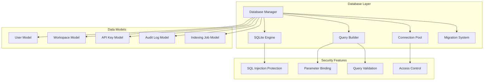

# 🗄️ Database Module

The database module provides a robust, secure database abstraction layer with SQLite for lightweight deployment and PostgreSQL readiness for enterprise scaling.

## 🏗️ Architecture



## 📁 Module Structure

```
database/
├── __init__.py              # Module exports
├── models.py               # SQLAlchemy data models
├── simple_connection.py    # Simple database connection manager
├── sqlite_models.py        # SQLite-specific implementations
└── README.md               # This documentation
```

## 🔧 Core Components

### SQLite Manager (`sqlite_models.py`)

Provides a lightweight, secure SQLite database implementation with enterprise-grade security features.

```python
from graphrag_api_service.database.sqlite_models import SQLiteManager

# Initialize database manager
db_manager = SQLiteManager(db_path="data/graphrag.db")

# Workspace operations
workspace = db_manager.create_workspace(
    name="My Project",
    description="GraphRAG workspace for my project",
    config={"llm_provider": "ollama", "model": "gemma:4b"}
)

# Retrieve workspace
workspace = db_manager.get_workspace(workspace_id)
workspaces = db_manager.list_workspaces(limit=10, offset=0)

# Update workspace
success = db_manager.update_workspace(
    workspace_id,
    {"description": "Updated description"}
)

# Delete workspace
success = db_manager.delete_workspace(workspace_id)
```

**Security Features:**
- **SQL Injection Protection**: Parameterized queries with explicit field mapping
- **Input Validation**: Comprehensive data validation before database operations
- **Access Control**: Role-based access to database operations
- **Audit Logging**: Complete audit trail for all database modifications

### Data Models (`models.py`)

Comprehensive SQLAlchemy models with relationships and constraints.

```python
from graphrag_api_service.database.models import User, Workspace, ApiKey, AuditLog

# User model with authentication
class User(Base):
    __tablename__ = "users"

    id = Column(String, primary_key=True, default=lambda: str(uuid4()))
    email = Column(String, unique=True, nullable=False, index=True)
    hashed_password = Column(String, nullable=False)
    full_name = Column(String)
    is_active = Column(Boolean, default=True)
    created_at = Column(DateTime, default=datetime.utcnow)

    # Relationships
    workspaces = relationship("Workspace", back_populates="owner")
    api_keys = relationship("ApiKey", back_populates="user")

# Workspace model with configuration
class Workspace(Base):
    __tablename__ = "workspaces"

    id = Column(String, primary_key=True, default=lambda: str(uuid4()))
    name = Column(String, nullable=False)
    description = Column(Text)
    config = Column(JSON)  # Flexible configuration storage
    status = Column(String, default="active")
    created_at = Column(DateTime, default=datetime.utcnow)
    updated_at = Column(DateTime, default=datetime.utcnow, onupdate=datetime.utcnow)

    # Foreign keys
    owner_id = Column(String, ForeignKey("users.id"))

    # Relationships
    owner = relationship("User", back_populates="workspaces")
    indexing_jobs = relationship("IndexingJob", back_populates="workspace")
```

### Connection Management (`simple_connection.py`)

Efficient database connection management with pooling and health checks.

```python
from graphrag_api_service.database.simple_connection import SimpleDatabaseManager

# Initialize connection manager
db_manager = SimpleDatabaseManager(
    database_url="sqlite:///./data/graphrag.db",
    pool_size=10,
    max_overflow=20,
    pool_timeout=30
)

# Get database session
async with db_manager.get_session() as session:
    # Perform database operations
    user = session.query(User).filter(User.email == "user@example.com").first()

    # Transaction handling
    try:
        session.add(new_workspace)
        session.commit()
    except Exception:
        session.rollback()
        raise
```

## 🔐 Security Features

### SQL Injection Protection

The database module implements comprehensive SQL injection protection:

```python
# SECURE: Parameterized queries with explicit field mapping
def get_workspace_secure(self, workspace_id: str) -> dict[str, Any] | None:
    """Secure workspace retrieval with parameter binding."""
    with sqlite3.connect(self.db_path) as conn:
        cursor = conn.execute(
            "SELECT id, name, description, config, created_at FROM workspaces WHERE id = ?",
            (workspace_id,)  # Parameterized query
        )
        row = cursor.fetchone()

        if row:
            # Explicit field mapping prevents injection
            return {
                "id": row[0],
                "name": row[1],
                "description": row[2],
                "config": json.loads(row[3]) if row[3] else {},
                "created_at": row[4]
            }
        return None

# SECURE: Input validation before database operations
def create_workspace(self, name: str, description: str | None = None,
                    config: dict[str, Any] | None = None) -> dict[str, Any]:
    """Create workspace with comprehensive input validation."""
    # Validate inputs
    if not name or len(name.strip()) == 0:
        raise ValueError("Workspace name is required")

    if len(name) > 255:
        raise ValueError("Workspace name too long")

    # Sanitize inputs
    name = name.strip()
    description = description.strip() if description else None

    # Safe database operation
    workspace_id = str(uuid4())
    config_json = json.dumps(config or {})

    with sqlite3.connect(self.db_path) as conn:
        conn.execute(
            """INSERT INTO workspaces (id, name, description, config)
               VALUES (?, ?, ?, ?)""",
            (workspace_id, name, description, config_json)
        )
        conn.commit()

    return self.get_workspace(workspace_id)
```

### Access Control

```python
from graphrag_api_service.database.models import User, UserRole

# Role-based database access
class SecureDatabaseManager:
    def __init__(self, current_user: User):
        self.current_user = current_user

    def get_accessible_workspaces(self) -> list[Workspace]:
        """Get workspaces accessible to current user."""
        if self.current_user.has_role("admin"):
            return self.session.query(Workspace).all()
        else:
            return self.session.query(Workspace).filter(
                Workspace.owner_id == self.current_user.id
            ).all()

    def can_modify_workspace(self, workspace_id: str) -> bool:
        """Check if user can modify workspace."""
        workspace = self.session.query(Workspace).get(workspace_id)
        return (
            workspace and (
                workspace.owner_id == self.current_user.id or
                self.current_user.has_role("admin")
            )
        )
```

## ⚙️ Configuration

### Environment Variables

```bash
# Database Configuration
DATABASE_URL=sqlite:///./data/graphrag.db
DATABASE_POOL_SIZE=10
DATABASE_MAX_OVERFLOW=20
DATABASE_POOL_TIMEOUT=30
DATABASE_POOL_RECYCLE=3600

# SQLite Specific
SQLITE_WAL_MODE=true
SQLITE_FOREIGN_KEYS=true
SQLITE_JOURNAL_MODE=WAL
SQLITE_SYNCHRONOUS=NORMAL

# Security
DATABASE_ENCRYPT=false
DATABASE_ENCRYPTION_KEY=your-encryption-key
DATABASE_BACKUP_ENABLED=true
DATABASE_BACKUP_INTERVAL=3600
```

### Database Initialization

```python
from graphrag_api_service.database.models import Base
from graphrag_api_service.database.simple_connection import get_simple_database_manager

# Initialize database schema
async def init_database():
    db_manager = get_simple_database_manager()

    # Create all tables
    Base.metadata.create_all(bind=db_manager.engine)

    # Create default admin user
    admin_user = User(
        email="admin@example.com",
        hashed_password=hash_password("admin_password"),
        full_name="System Administrator",
        roles=[UserRole(role_name="admin")]
    )

    async with db_manager.get_session() as session:
        session.add(admin_user)
        session.commit()
```

## 📊 Data Models Reference

### User Model
```python
class User(Base):
    id: str                    # UUID primary key
    email: str                 # Unique email address
    hashed_password: str       # bcrypt hashed password
    full_name: str            # User's full name
    is_active: bool           # Account status
    created_at: datetime      # Account creation timestamp
    updated_at: datetime      # Last update timestamp

    # Relationships
    workspaces: List[Workspace]
    api_keys: List[ApiKey]
    roles: List[UserRole]
```

### Workspace Model
```python
class Workspace(Base):
    id: str                   # UUID primary key
    name: str                 # Workspace name
    description: str          # Optional description
    config: dict              # JSON configuration
    status: str               # active, archived, deleted
    data_path: str            # Path to workspace data
    created_at: datetime      # Creation timestamp
    updated_at: datetime      # Last update timestamp

    # Foreign Keys
    owner_id: str             # Reference to User.id

    # Relationships
    owner: User
    indexing_jobs: List[IndexingJob]
```

### API Key Model
```python
class ApiKey(Base):
    id: str                   # UUID primary key
    name: str                 # Human-readable name
    key_hash: str             # Hashed API key
    prefix: str               # Key prefix for identification
    permissions: List[str]    # JSON array of permissions
    is_active: bool           # Key status
    expires_at: datetime      # Expiration timestamp
    last_used_at: datetime    # Last usage timestamp
    created_at: datetime      # Creation timestamp

    # Foreign Keys
    user_id: str              # Reference to User.id

    # Relationships
    user: User
```

### Indexing Job Model
```python
class IndexingJob(Base):
    id: str                   # UUID primary key
    status: str               # pending, running, completed, failed
    progress: float           # Progress percentage (0-100)
    config: dict              # Job configuration
    result: dict              # Job results
    error_message: str        # Error details if failed
    started_at: datetime      # Job start timestamp
    completed_at: datetime    # Job completion timestamp
    created_at: datetime      # Creation timestamp

    # Foreign Keys
    workspace_id: str         # Reference to Workspace.id

    # Relationships
    workspace: Workspace
```

## 🔄 Database Migrations

### Migration System
```python
from alembic import command
from alembic.config import Config

def run_migrations():
    """Run database migrations."""
    alembic_cfg = Config("alembic.ini")
    command.upgrade(alembic_cfg, "head")

def create_migration(message: str):
    """Create new migration."""
    alembic_cfg = Config("alembic.ini")
    command.revision(alembic_cfg, message=message, autogenerate=True)
```

### Migration Example
```python
"""Add workspace status column

Revision ID: 001
Revises:
Create Date: 2024-01-01 12:00:00.000000
"""

from alembic import op
import sqlalchemy as sa

def upgrade():
    op.add_column('workspaces',
        sa.Column('status', sa.String(50), nullable=False, default='active')
    )

    # Create index for better query performance
    op.create_index('ix_workspaces_status', 'workspaces', ['status'])

def downgrade():
    op.drop_index('ix_workspaces_status', 'workspaces')
    op.drop_column('workspaces', 'status')
```

## 🧪 Testing

### Unit Tests
```python
import pytest
from graphrag_api_service.database.sqlite_models import SQLiteManager

@pytest.fixture
def db_manager():
    # Use in-memory database for testing
    manager = SQLiteManager(":memory:")
    yield manager

def test_workspace_creation(db_manager):
    workspace = db_manager.create_workspace(
        name="Test Workspace",
        description="Test description"
    )

    assert workspace["name"] == "Test Workspace"
    assert workspace["description"] == "Test description"
    assert "id" in workspace

def test_sql_injection_protection(db_manager):
    # Attempt SQL injection
    malicious_input = "'; DROP TABLE workspaces; --"

    # Should not raise exception or affect database
    result = db_manager.get_workspace(malicious_input)
    assert result is None

    # Verify table still exists
    workspaces = db_manager.list_workspaces()
    assert isinstance(workspaces, list)
```

### Integration Tests
```python
async def test_database_transaction(db_session):
    # Test transaction rollback
    try:
        user = User(email="test@example.com")
        db_session.add(user)

        # Simulate error
        raise Exception("Test error")

        db_session.commit()
    except Exception:
        db_session.rollback()

    # Verify rollback worked
    user_count = db_session.query(User).count()
    assert user_count == 0
```

## 🚨 Best Practices

1. **Always Use Parameterized Queries**: Never concatenate user input into SQL
2. **Validate Input**: Sanitize and validate all user inputs
3. **Use Transactions**: Wrap related operations in transactions
4. **Handle Errors Gracefully**: Proper exception handling and rollback
5. **Index Frequently Queried Columns**: Optimize query performance
6. **Regular Backups**: Implement automated backup strategy
7. **Monitor Performance**: Track query performance and optimize slow queries
8. **Connection Pooling**: Use connection pools for better performance

## 📈 Performance Optimization

### Query Optimization
```python
# Use indexes for frequently queried columns
class Workspace(Base):
    __tablename__ = "workspaces"

    id = Column(String, primary_key=True)
    name = Column(String, nullable=False, index=True)  # Indexed
    owner_id = Column(String, ForeignKey("users.id"), index=True)  # Indexed
    status = Column(String, default="active", index=True)  # Indexed

# Efficient queries with proper joins
def get_user_workspaces(user_id: str):
    return session.query(Workspace).options(
        joinedload(Workspace.owner)  # Eager loading
    ).filter(
        Workspace.owner_id == user_id,
        Workspace.status == "active"
    ).all()
```

### Connection Pool Tuning
```python
# Optimize connection pool settings
DATABASE_CONFIG = {
    "pool_size": 10,          # Base connections
    "max_overflow": 20,       # Additional connections
    "pool_timeout": 30,       # Connection timeout
    "pool_recycle": 3600,     # Recycle connections hourly
    "pool_pre_ping": True     # Validate connections
}
```

## 🔧 Troubleshooting

### Common Issues

1. **Database Locked Error**
   ```python
   # Enable WAL mode for better concurrency
   with sqlite3.connect(db_path) as conn:
       conn.execute("PRAGMA journal_mode=WAL")
   ```

2. **Connection Pool Exhaustion**
   ```python
   # Monitor connection usage
   engine = create_engine(DATABASE_URL, echo=True)
   print(f"Pool size: {engine.pool.size()}")
   print(f"Checked out: {engine.pool.checkedout()}")
   ```

3. **Slow Queries**
   ```sql
   -- Analyze query performance
   EXPLAIN QUERY PLAN SELECT * FROM workspaces WHERE owner_id = ?;

   -- Add missing indexes
   CREATE INDEX ix_workspaces_owner_id ON workspaces(owner_id);
   ```

---

For more information, see the [main documentation](../../../README.md) or other module documentation.
