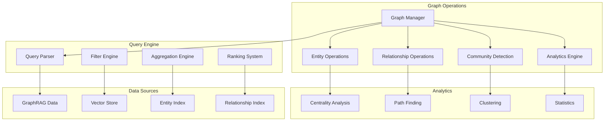

# 🕸️ Graph Operations Module

The graph operations module provides comprehensive knowledge graph analysis, querying, and visualization capabilities with advanced analytics and community detection.

## 🏗️ Architecture



## 📁 Module Structure

```
graph/
├── __init__.py              # Module exports
├── operations.py           # Core graph operations
└── README.md               # This documentation
```

## 🔧 Core Components

### Graph Operations Manager (`operations.py`)

Provides comprehensive graph analysis and querying capabilities.

```python
from graphrag_api_service.graph.operations import GraphOperations

# Initialize graph operations
graph_ops = GraphOperations(data_path="/path/to/graphrag/data")

# Entity operations
entities = await graph_ops.get_entities(
    limit=100,
    offset=0,
    entity_name="Microsoft",
    entity_type="Organization"
)

# Relationship operations
relationships = await graph_ops.get_relationships(
    limit=50,
    source_entity="Microsoft",
    target_entity="OpenAI",
    relationship_type="Partnership"
)

# Community detection
communities = await graph_ops.get_communities(
    min_community_size=5,
    max_communities=20
)

# Graph statistics
stats = await graph_ops.get_graph_statistics()
print(f"Total entities: {stats['total_entities']}")
print(f"Total relationships: {stats['total_relationships']}")
print(f"Graph density: {stats['graph_density']:.3f}")
```

### Entity Operations

Advanced entity querying with filtering, ranking, and analytics.

```python
# Basic entity retrieval
entities = await graph_ops.get_entities(
    limit=100,
    offset=0,
    entity_name="Microsoft",  # Exact or partial match
    entity_type="Organization",
    description_contains="technology"
)

# Entity with relationships
entity_details = await graph_ops.get_entity_with_relationships(
    entity_id="entity_123",
    relationship_limit=20,
    include_community_info=True
)

# Entity ranking by centrality
top_entities = await graph_ops.get_top_entities_by_centrality(
    centrality_type="betweenness",  # degree, closeness, betweenness, pagerank
    limit=10,
    entity_type="Person"
)

# Entity clustering
entity_clusters = await graph_ops.cluster_entities_by_similarity(
    similarity_threshold=0.8,
    clustering_method="hierarchical"
)
```

### Relationship Operations

Comprehensive relationship analysis and querying.

```python
# Basic relationship retrieval
relationships = await graph_ops.get_relationships(
    limit=100,
    offset=0,
    source_entity="Microsoft",
    target_entity="OpenAI",
    relationship_type="Partnership",
    weight_threshold=0.5
)

# Multi-hop relationship discovery
paths = await graph_ops.find_paths_between_entities(
    source_entity="Microsoft",
    target_entity="Google",
    max_hops=3,
    path_type="shortest"  # shortest, all, weighted
)

# Relationship strength analysis
strong_relationships = await graph_ops.get_strongest_relationships(
    entity_id="entity_123",
    relationship_types=["Partnership", "Acquisition"],
    limit=10
)

# Relationship patterns
patterns = await graph_ops.analyze_relationship_patterns(
    entity_type="Organization",
    relationship_type="Partnership",
    time_window="2023-01-01:2024-01-01"
)
```

### Community Detection

Advanced community detection and analysis algorithms.

```python
# Community detection with multiple algorithms
communities = await graph_ops.detect_communities(
    algorithm="louvain",  # louvain, leiden, label_propagation
    resolution=1.0,
    min_community_size=5,
    max_communities=50
)

# Community analysis
community_stats = await graph_ops.analyze_community(
    community_id="community_123",
    include_subgraphs=True,
    calculate_metrics=True
)

# Inter-community relationships
inter_community = await graph_ops.get_inter_community_relationships(
    community_1="community_123",
    community_2="community_456",
    relationship_types=["Partnership", "Collaboration"]
)

# Community evolution over time
evolution = await graph_ops.track_community_evolution(
    community_id="community_123",
    time_periods=["2023-Q1", "2023-Q2", "2023-Q3", "2023-Q4"]
)
```

## 📊 Advanced Analytics

### Centrality Analysis

```python
# Calculate various centrality measures
centrality_results = await graph_ops.calculate_centrality_measures(
    measures=["degree", "betweenness", "closeness", "pagerank"],
    entity_types=["Person", "Organization"],
    normalize=True
)

# Identify key entities
key_entities = await graph_ops.identify_key_entities(
    centrality_threshold=0.8,
    min_connections=10,
    entity_types=["Person"]
)

# Centrality distribution analysis
distribution = await graph_ops.analyze_centrality_distribution(
    centrality_type="betweenness",
    bins=20
)
```

### Path Analysis

```python
# Shortest path analysis
shortest_paths = await graph_ops.find_shortest_paths(
    source_entities=["Microsoft", "Google"],
    target_entities=["OpenAI", "Anthropic"],
    max_path_length=4
)

# Critical path identification
critical_paths = await graph_ops.identify_critical_paths(
    importance_threshold=0.7,
    path_length_range=(2, 5)
)

# Path diversity analysis
path_diversity = await graph_ops.analyze_path_diversity(
    source_entity="Microsoft",
    target_entity="OpenAI",
    num_paths=10
)
```

### Graph Statistics

```python
# Comprehensive graph statistics
stats = await graph_ops.get_comprehensive_statistics()
"""
Returns:
{
    "nodes": {
        "total_entities": 1000,
        "entity_types": {"Person": 400, "Organization": 300, "Location": 300},
        "avg_degree": 5.2,
        "degree_distribution": {...}
    },
    "edges": {
        "total_relationships": 2500,
        "relationship_types": {"Partnership": 800, "Employment": 600, ...},
        "avg_weight": 0.65,
        "weight_distribution": {...}
    },
    "structure": {
        "density": 0.005,
        "clustering_coefficient": 0.3,
        "diameter": 8,
        "connected_components": 5
    },
    "communities": {
        "total_communities": 25,
        "avg_community_size": 40,
        "modularity": 0.45
    }
}
"""
```

## 🎯 Query Optimization

### Efficient Filtering

```python
# Optimized entity queries with indexes
entities = await graph_ops.get_entities_optimized(
    filters={
        "entity_type": ["Person", "Organization"],
        "degree_range": (5, 50),
        "centrality_threshold": 0.1,
        "community_size_min": 10
    },
    sort_by="degree",
    sort_order="desc",
    limit=100
)

# Batch entity retrieval
entity_batch = await graph_ops.get_entities_batch(
    entity_ids=["entity_1", "entity_2", "entity_3"],
    include_relationships=True,
    relationship_limit=10
)
```

### Caching Strategies

```python
# Cache frequently accessed graph data
@cache_result(ttl=3600, key_prefix="graph_stats")
async def get_cached_graph_statistics(data_path: str):
    return await graph_ops.get_graph_statistics()

# Cache community detection results
@cache_result(ttl=7200, key_prefix="communities")
async def get_cached_communities(algorithm: str, resolution: float):
    return await graph_ops.detect_communities(algorithm, resolution)
```

## 🔍 Visualization Support

### Graph Visualization Data

```python
# Generate visualization-ready data
viz_data = await graph_ops.get_visualization_data(
    layout_algorithm="force_directed",  # force_directed, circular, hierarchical
    node_limit=200,
    edge_limit=500,
    include_communities=True,
    color_by="community",
    size_by="degree"
)

"""
Returns:
{
    "nodes": [
        {
            "id": "entity_123",
            "label": "Microsoft",
            "type": "Organization",
            "size": 15,
            "color": "#ff6b6b",
            "community": "tech_giants",
            "centrality": 0.85,
            "x": 100.5,
            "y": 200.3
        }
    ],
    "edges": [
        {
            "source": "entity_123",
            "target": "entity_456",
            "type": "Partnership",
            "weight": 0.8,
            "color": "#4ecdc4"
        }
    ],
    "communities": [
        {
            "id": "tech_giants",
            "label": "Technology Giants",
            "size": 25,
            "color": "#ff6b6b"
        }
    ]
}
"""
```

### Interactive Exploration

```python
# Get neighborhood for interactive exploration
neighborhood = await graph_ops.get_entity_neighborhood(
    entity_id="entity_123",
    hops=2,
    max_neighbors=50,
    relationship_types=["Partnership", "Acquisition"],
    include_metadata=True
)

# Expand graph incrementally
expanded_graph = await graph_ops.expand_graph_from_entities(
    seed_entities=["Microsoft", "Google"],
    expansion_steps=3,
    max_nodes_per_step=20,
    relationship_strength_threshold=0.5
)
```

## ⚙️ Configuration

### Environment Variables

```bash
# Graph Operations Configuration
GRAPHRAG_DATA_PATH=/path/to/graphrag/data
GRAPH_CACHE_TTL=3600
GRAPH_MAX_ENTITIES_PER_QUERY=1000
GRAPH_MAX_RELATIONSHIPS_PER_QUERY=2000

# Analytics Configuration
CENTRALITY_CALCULATION_TIMEOUT=300
COMMUNITY_DETECTION_TIMEOUT=600
PATH_FINDING_MAX_DEPTH=6
CLUSTERING_MAX_ITERATIONS=100

# Performance Settings
GRAPH_PARALLEL_PROCESSING=true
GRAPH_WORKER_THREADS=4
GRAPH_MEMORY_LIMIT_GB=8
GRAPH_BATCH_SIZE=100
```

### Advanced Configuration

```python
from graphrag_api_service.graph.operations import GraphConfig

config = GraphConfig(
    # Data settings
    data_path="/path/to/graphrag/data",
    cache_enabled=True,
    cache_ttl=3600,

    # Query limits
    max_entities_per_query=1000,
    max_relationships_per_query=2000,
    max_communities_per_query=100,

    # Analytics settings
    centrality_algorithms=["degree", "betweenness", "closeness"],
    community_algorithms=["louvain", "leiden"],
    clustering_algorithms=["hierarchical", "kmeans"],

    # Performance settings
    parallel_processing=True,
    worker_threads=4,
    memory_limit_gb=8,
    batch_size=100,

    # Visualization settings
    default_layout="force_directed",
    max_viz_nodes=500,
    max_viz_edges=1000
)

graph_ops = GraphOperations(config)
```

## 🧪 Testing

### Unit Tests

```python
import pytest
from graphrag_api_service.graph.operations import GraphOperations

@pytest.fixture
def graph_ops():
    return GraphOperations(data_path="tests/data/sample_graph")

async def test_entity_retrieval(graph_ops):
    entities = await graph_ops.get_entities(limit=10)

    assert len(entities) <= 10
    assert all("id" in entity for entity in entities)
    assert all("name" in entity for entity in entities)

async def test_relationship_filtering(graph_ops):
    relationships = await graph_ops.get_relationships(
        relationship_type="Partnership",
        weight_threshold=0.5
    )

    for rel in relationships:
        assert rel["type"] == "Partnership"
        assert rel["weight"] >= 0.5

async def test_community_detection(graph_ops):
    communities = await graph_ops.detect_communities(
        algorithm="louvain",
        min_community_size=3
    )

    assert len(communities) > 0
    assert all(len(comm["entities"]) >= 3 for comm in communities)
```

### Integration Tests

```python
async def test_graph_analytics_pipeline(graph_ops):
    # Test complete analytics pipeline

    # 1. Get graph statistics
    stats = await graph_ops.get_graph_statistics()
    assert stats["total_entities"] > 0

    # 2. Detect communities
    communities = await graph_ops.detect_communities()
    assert len(communities) > 0

    # 3. Calculate centrality
    centrality = await graph_ops.calculate_centrality_measures()
    assert "degree" in centrality

    # 4. Generate visualization data
    viz_data = await graph_ops.get_visualization_data()
    assert "nodes" in viz_data
    assert "edges" in viz_data
```

## 🚨 Best Practices

1. **Query Optimization**: Use appropriate limits and filters
2. **Caching**: Cache expensive operations like community detection
3. **Batch Processing**: Process large datasets in batches
4. **Memory Management**: Monitor memory usage for large graphs
5. **Error Handling**: Handle missing data gracefully
6. **Performance Monitoring**: Track query performance metrics
7. **Data Validation**: Validate graph data integrity
8. **Incremental Updates**: Update graph data incrementally

## 📈 Performance Optimization

### Query Performance

```python
# Use indexes for common queries
entities = await graph_ops.get_entities_indexed(
    entity_type="Organization",  # Indexed field
    degree_range=(10, 100),      # Indexed range
    limit=50
)

# Batch operations for better performance
entity_details = await graph_ops.get_entities_with_details_batch(
    entity_ids=entity_list,
    batch_size=50
)
```

### Memory Optimization

```python
# Stream large result sets
async for entity_batch in graph_ops.stream_entities(batch_size=100):
    # Process batch
    await process_entity_batch(entity_batch)

# Use generators for large datasets
entity_generator = graph_ops.generate_entities(
    filters={"entity_type": "Person"},
    chunk_size=50
)
```

## 🔧 Troubleshooting

### Common Issues

1. **Memory Issues with Large Graphs**

   ```python
   # Reduce batch sizes
   config.batch_size = 50
   config.memory_limit_gb = 4
   ```

2. **Slow Community Detection**

   ```python
   # Use faster algorithms for large graphs
   communities = await graph_ops.detect_communities(
       algorithm="label_propagation",  # Faster than Louvain
       max_iterations=50
   )
   ```

3. **Query Timeouts**

   ```python
   # Increase timeouts for complex queries
   config.centrality_calculation_timeout = 600
   config.community_detection_timeout = 1200
   ```

### Performance Monitoring

```python
# Monitor graph operation performance
performance_stats = await graph_ops.get_performance_stats()
print(f"Average query time: {performance_stats['avg_query_time']:.2f}s")
print(f"Cache hit rate: {performance_stats['cache_hit_rate']:.2%}")
print(f"Memory usage: {performance_stats['memory_usage_mb']} MB")
```

---

For more information, see the [main documentation](../../../README.md) or other module documentation.
