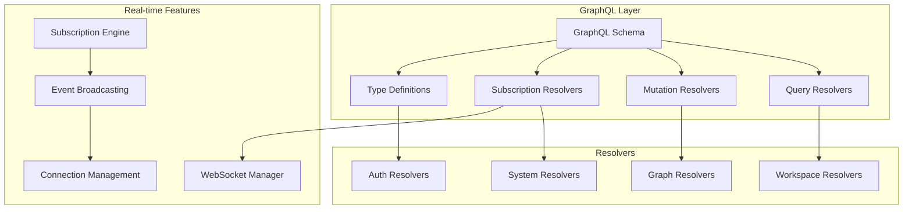

# 🚀 GraphQL API Module

The GraphQL module provides a modern, flexible GraphQL API with real-time subscriptions, comprehensive schema, and 100% feature parity with the REST API.

## 🏗️ Architecture



## 📁 Module Structure

```
graphql/
├── __init__.py              # Module exports
├── mutations.py            # GraphQL mutations
├── queries.py              # GraphQL queries
├── schema.py               # GraphQL schema definition
├── subscriptions.py        # GraphQL subscriptions
├── types.py                # GraphQL type definitions
└── README.md               # This documentation
```

## 🔧 Core Components

### Schema Definition (`schema.py`)

Complete GraphQL schema with queries, mutations, and subscriptions.

```python
import strawberry
from graphrag_api_service.graphql.queries import Query
from graphrag_api_service.graphql.mutations import Mutation
from graphrag_api_service.graphql.subscriptions import Subscription

# Create GraphQL schema
schema = strawberry.Schema(
    query=Query,
    mutation=Mutation,
    subscription=Subscription
)

# Schema introspection
schema_sdl = schema.as_str()
```

### Type Definitions (`types.py`)

Comprehensive type system for all GraphRAG entities.

```python
import strawberry
from typing import List, Optional
from datetime import datetime

@strawberry.type
class Entity:
    id: str
    name: str
    type: str
    description: Optional[str] = None
    degree: int
    community_id: Optional[str] = None
    centrality_scores: Optional[dict] = None
    created_at: datetime

@strawberry.type
class Relationship:
    id: str
    source_entity: Entity
    target_entity: Entity
    type: str
    weight: float
    description: Optional[str] = None
    created_at: datetime

@strawberry.type
class Community:
    id: str
    name: str
    size: int
    entities: List[Entity]
    relationships: List[Relationship]
    modularity: float
    created_at: datetime

@strawberry.type
class Workspace:
    id: str
    name: str
    description: Optional[str] = None
    config: dict
    status: str
    owner: User
    created_at: datetime
    updated_at: datetime

    # Computed fields
    entity_count: int
    relationship_count: int
    community_count: int

@strawberry.type
class GraphStatistics:
    total_entities: int
    total_relationships: int
    total_communities: int
    entity_types: dict
    relationship_types: dict
    graph_density: float
    clustering_coefficient: float
    average_degree: float
```

### Query Resolvers (`queries.py`)

Comprehensive query operations with filtering and pagination.

```python
import strawberry
from typing import List, Optional
from graphrag_api_service.graphql.types import *

@strawberry.type
class Query:

    @strawberry.field
    async def workspaces(
        self,
        limit: int = 50,
        offset: int = 0,
        status: Optional[str] = None
    ) -> List[Workspace]:
        """Get workspaces with optional filtering."""
        # Implementation with database query
        return await workspace_service.get_workspaces(limit, offset, status)

    @strawberry.field
    async def workspace(self, id: str) -> Optional[Workspace]:
        """Get workspace by ID."""
        return await workspace_service.get_workspace(id)

    @strawberry.field
    async def entities(
        self,
        workspace_id: str,
        limit: int = 100,
        offset: int = 0,
        entity_type: Optional[str] = None,
        name_contains: Optional[str] = None
    ) -> List[Entity]:
        """Get entities with filtering and pagination."""
        return await graph_service.get_entities(
            workspace_id, limit, offset, entity_type, name_contains
        )

    @strawberry.field
    async def relationships(
        self,
        workspace_id: str,
        limit: int = 100,
        offset: int = 0,
        relationship_type: Optional[str] = None,
        source_entity: Optional[str] = None,
        target_entity: Optional[str] = None
    ) -> List[Relationship]:
        """Get relationships with filtering."""
        return await graph_service.get_relationships(
            workspace_id, limit, offset, relationship_type, source_entity, target_entity
        )

    @strawberry.field
    async def communities(
        self,
        workspace_id: str,
        min_size: int = 5,
        algorithm: str = "louvain"
    ) -> List[Community]:
        """Get communities using specified algorithm."""
        return await graph_service.get_communities(workspace_id, min_size, algorithm)

    @strawberry.field
    async def graph_statistics(self, workspace_id: str) -> GraphStatistics:
        """Get comprehensive graph statistics."""
        return await graph_service.get_statistics(workspace_id)

    @strawberry.field
    async def search_entities(
        self,
        workspace_id: str,
        query: str,
        limit: int = 20,
        entity_types: Optional[List[str]] = None
    ) -> List[Entity]:
        """Search entities by name or description."""
        return await search_service.search_entities(
            workspace_id, query, limit, entity_types
        )
```

### Mutation Resolvers (`mutations.py`)

Complete CRUD operations with input validation.

```python
import strawberry
from typing import Optional
from graphrag_api_service.graphql.types import *

@strawberry.input
class WorkspaceCreateInput:
    name: str
    description: Optional[str] = None
    config: Optional[dict] = None

@strawberry.input
class WorkspaceUpdateInput:
    name: Optional[str] = None
    description: Optional[str] = None
    config: Optional[dict] = None

@strawberry.input
class IndexingJobInput:
    workspace_id: str
    data_path: str
    config: Optional[dict] = None

@strawberry.type
class Mutation:

    @strawberry.mutation
    async def create_workspace(
        self,
        input: WorkspaceCreateInput,
        info: strawberry.Info
    ) -> Workspace:
        """Create a new workspace."""
        current_user = await get_current_user(info.context)
        return await workspace_service.create_workspace(
            name=input.name,
            description=input.description,
            config=input.config,
            owner_id=current_user.id
        )

    @strawberry.mutation
    async def update_workspace(
        self,
        id: str,
        input: WorkspaceUpdateInput,
        info: strawberry.Info
    ) -> Optional[Workspace]:
        """Update workspace."""
        current_user = await get_current_user(info.context)
        await check_workspace_permission(id, current_user, "write")

        return await workspace_service.update_workspace(id, input)

    @strawberry.mutation
    async def delete_workspace(
        self,
        id: str,
        info: strawberry.Info
    ) -> bool:
        """Delete workspace."""
        current_user = await get_current_user(info.context)
        await check_workspace_permission(id, current_user, "delete")

        return await workspace_service.delete_workspace(id)

    @strawberry.mutation
    async def start_indexing(
        self,
        input: IndexingJobInput,
        info: strawberry.Info
    ) -> IndexingJob:
        """Start indexing job."""
        current_user = await get_current_user(info.context)
        await check_workspace_permission(input.workspace_id, current_user, "write")

        return await indexing_service.start_job(
            workspace_id=input.workspace_id,
            data_path=input.data_path,
            config=input.config,
            user_id=current_user.id
        )
```

### Subscription Resolvers (`subscriptions.py`)

Real-time subscriptions for live updates.

```python
import strawberry
from typing import AsyncGenerator
from graphrag_api_service.graphql.types import *

@strawberry.type
class Subscription:

    @strawberry.subscription
    async def indexing_progress(
        self,
        job_id: str,
        info: strawberry.Info
    ) -> AsyncGenerator[IndexingProgress, None]:
        """Subscribe to indexing job progress."""
        current_user = await get_current_user(info.context)

        # Verify user has access to this job
        job = await indexing_service.get_job(job_id)
        await check_workspace_permission(job.workspace_id, current_user, "read")

        # Stream progress updates
        async for progress in indexing_service.stream_progress(job_id):
            yield progress

    @strawberry.subscription
    async def workspace_updates(
        self,
        workspace_id: str,
        info: strawberry.Info
    ) -> AsyncGenerator[WorkspaceUpdate, None]:
        """Subscribe to workspace updates."""
        current_user = await get_current_user(info.context)
        await check_workspace_permission(workspace_id, current_user, "read")

        # Stream workspace updates
        async for update in workspace_service.stream_updates(workspace_id):
            yield update

    @strawberry.subscription
    async def system_metrics(
        self,
        info: strawberry.Info
    ) -> AsyncGenerator[SystemMetrics, None]:
        """Subscribe to system metrics (admin only)."""
        current_user = await get_current_user(info.context)
        if not current_user.has_role("admin"):
            raise PermissionError("Admin access required")

        # Stream system metrics
        async for metrics in monitoring_service.stream_metrics():
            yield metrics
```

## 🔌 Integration Examples

### FastAPI Integration

```python
from fastapi import FastAPI
from strawberry.fastapi import GraphQLRouter
from graphrag_api_service.graphql.schema import schema

app = FastAPI()

# Add GraphQL endpoint
graphql_app = GraphQLRouter(
    schema,
    graphiql=True,  # Enable GraphQL Playground
    context_getter=get_graphql_context
)

app.include_router(graphql_app, prefix="/graphql")

async def get_graphql_context(request):
    """Provide context for GraphQL resolvers."""
    return {
        "request": request,
        "user": await get_current_user_from_request(request),
        "db": get_database_session(),
        "cache": get_cache_manager()
    }
```

### Client Usage Examples

#### JavaScript/TypeScript Client

```typescript
import { GraphQLClient, gql } from 'graphql-request'

const client = new GraphQLClient('http://localhost:8000/graphql', {
  headers: {
    authorization: `Bearer ${token}`,
  },
})

// Query workspaces
const GET_WORKSPACES = gql`
  query GetWorkspaces($limit: Int, $offset: Int) {
    workspaces(limit: $limit, offset: $offset) {
      id
      name
      description
      status
      entityCount
      relationshipCount
      createdAt
    }
  }
`

const workspaces = await client.request(GET_WORKSPACES, {
  limit: 10,
  offset: 0
})

// Create workspace mutation
const CREATE_WORKSPACE = gql`
  mutation CreateWorkspace($input: WorkspaceCreateInput!) {
    createWorkspace(input: $input) {
      id
      name
      description
      status
      createdAt
    }
  }
`

const newWorkspace = await client.request(CREATE_WORKSPACE, {
  input: {
    name: "My New Workspace",
    description: "A workspace for my project"
  }
})

// Subscribe to indexing progress
const INDEXING_PROGRESS = gql`
  subscription IndexingProgress($jobId: String!) {
    indexingProgress(jobId: $jobId) {
      jobId
      status
      progress
      currentStep
      totalSteps
      estimatedTimeRemaining
    }
  }
`

// WebSocket subscription
const subscription = client.subscribe(INDEXING_PROGRESS, {
  jobId: "job_123"
})

for await (const result of subscription) {
  console.log('Progress:', result.data.indexingProgress)
}
```

#### Python Client

```python
from gql import gql, Client
from gql.transport.aiohttp import AIOHTTPTransport

# Setup client
transport = AIOHTTPTransport(
    url="http://localhost:8000/graphql",
    headers={"Authorization": f"Bearer {token}"}
)
client = Client(transport=transport, fetch_schema_from_transport=True)

# Query entities
query = gql("""
    query GetEntities($workspaceId: String!, $limit: Int) {
        entities(workspaceId: $workspaceId, limit: $limit) {
            id
            name
            type
            degree
            centralityScores
            community {
                id
                name
            }
        }
    }
""")

result = await client.execute_async(query, variable_values={
    "workspaceId": "workspace_123",
    "limit": 50
})

entities = result["entities"]
```

## 🔐 Security Features

### Authentication & Authorization

```python
from strawberry.types import Info
from graphrag_api_service.auth.jwt_auth import get_current_user_from_context

async def get_current_user(info: Info):
    """Extract current user from GraphQL context."""
    return await get_current_user_from_context(info.context)

async def require_permission(permission: str, info: Info):
    """Check if user has required permission."""
    user = await get_current_user(info)
    if not user.has_permission(permission):
        raise PermissionError(f"Permission '{permission}' required")
    return user

# Usage in resolvers
@strawberry.field
async def sensitive_data(self, info: Info) -> str:
    await require_permission("read:sensitive", info)
    return "Sensitive information"
```

### Input Validation

```python
import strawberry
from typing import Optional
from pydantic import validator

@strawberry.input
class WorkspaceCreateInput:
    name: str
    description: Optional[str] = None

    @validator('name')
    def validate_name(cls, v):
        if not v or len(v.strip()) == 0:
            raise ValueError('Name is required')
        if len(v) > 255:
            raise ValueError('Name too long')
        return v.strip()
```

## 📊 Performance Optimization

### Query Complexity Analysis

```python
from strawberry.extensions import QueryDepthLimiter, ValidationCache

schema = strawberry.Schema(
    query=Query,
    mutation=Mutation,
    subscription=Subscription,
    extensions=[
        QueryDepthLimiter(max_depth=10),  # Prevent deep queries
        ValidationCache(maxsize=100)      # Cache query validation
    ]
)
```

### DataLoader Pattern

```python
from strawberry.dataloader import DataLoader
from typing import List

async def load_entities_by_workspace(workspace_ids: List[str]) -> List[List[Entity]]:
    """Batch load entities for multiple workspaces."""
    # Single database query for all workspaces
    entities_by_workspace = await db.get_entities_by_workspaces(workspace_ids)

    # Return in same order as input
    return [entities_by_workspace.get(ws_id, []) for ws_id in workspace_ids]

# Create DataLoader
entity_loader = DataLoader(load_fn=load_entities_by_workspace)

@strawberry.field
async def entities(self, workspace_id: str) -> List[Entity]:
    """Load entities using DataLoader to prevent N+1 queries."""
    return await entity_loader.load(workspace_id)
```

## 🧪 Testing

### Unit Tests

```python
import pytest
from strawberry.test import BaseGraphQLTestClient
from graphrag_api_service.graphql.schema import schema

@pytest.fixture
def graphql_client():
    return BaseGraphQLTestClient(schema)

def test_workspace_query(graphql_client):
    query = """
        query {
            workspaces(limit: 5) {
                id
                name
                status
            }
        }
    """

    result = graphql_client.query(query)
    assert result.errors is None
    assert "workspaces" in result.data
    assert len(result.data["workspaces"]) <= 5

def test_create_workspace_mutation(graphql_client):
    mutation = """
        mutation CreateWorkspace($input: WorkspaceCreateInput!) {
            createWorkspace(input: $input) {
                id
                name
                description
            }
        }
    """

    result = graphql_client.query(
        mutation,
        variables={
            "input": {
                "name": "Test Workspace",
                "description": "Test description"
            }
        }
    )

    assert result.errors is None
    assert result.data["createWorkspace"]["name"] == "Test Workspace"
```

### Integration Tests

```python
async def test_graphql_with_authentication(client, auth_headers):
    query = """
        query {
            workspaces {
                id
                name
                owner {
                    email
                }
            }
        }
    """

    response = await client.post(
        "/graphql",
        json={"query": query},
        headers=auth_headers
    )

    assert response.status_code == 200
    data = response.json()
    assert "errors" not in data
    assert "workspaces" in data["data"]
```

## 🚨 Best Practices

1. **Query Complexity**: Limit query depth and complexity
2. **Authentication**: Always validate user permissions
3. **Input Validation**: Validate all input data
4. **Error Handling**: Provide meaningful error messages
5. **Caching**: Use DataLoaders to prevent N+1 queries
6. **Rate Limiting**: Implement query rate limiting
7. **Monitoring**: Track GraphQL query performance
8. **Schema Evolution**: Use schema versioning for breaking changes

## 📈 Monitoring & Metrics

### Query Analytics

```python
from strawberry.extensions import Extension

class QueryAnalyticsExtension(Extension):
    def on_request_start(self):
        self.start_time = time.time()

    def on_request_end(self):
        duration = time.time() - self.start_time

        # Log query metrics
        logger.info(f"GraphQL query executed in {duration:.3f}s")

        # Send to monitoring system
        metrics.histogram("graphql.query.duration", duration)
        metrics.counter("graphql.query.count").increment()

# Add to schema
schema = strawberry.Schema(
    query=Query,
    extensions=[QueryAnalyticsExtension()]
)
```

### Error Tracking

```python
import strawberry
from strawberry.types import ExecutionResult

async def process_errors(errors, result: ExecutionResult):
    """Process GraphQL errors for monitoring."""
    for error in errors:
        # Log error details
        logger.error(f"GraphQL error: {error.message}", extra={
            "path": error.path,
            "locations": error.locations,
            "extensions": error.extensions
        })

        # Send to error tracking service
        error_tracker.capture_exception(error.original_error)

schema = strawberry.Schema(
    query=Query,
    process_errors=process_errors
)
```

---

For more information, see the [main documentation](../../../README.md) or other module documentation.
