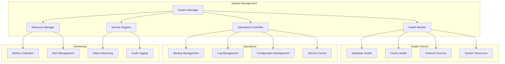

# 🔧 System Module

The system module provides comprehensive system health monitoring, administrative operations, and infrastructure management capabilities for enterprise-grade system operations.

## 🏗️ Architecture



## 📁 Module Structure

```
system/
├── __init__.py              # Module exports
├── health.py               # Health check implementations
├── operations.py           # System operations management
└── README.md               # This documentation
```

## 🔧 Core Components

### Health Monitoring (`health.py`)

Comprehensive health check system with detailed diagnostics.

```python
from graphrag_api_service.system.health import SystemHealthMonitor

# Initialize health monitor
health_monitor = SystemHealthMonitor()

# Perform comprehensive health check
health_status = await health_monitor.check_system_health()

# Individual health checks
database_health = await health_monitor.check_database_health()
cache_health = await health_monitor.check_cache_health()
service_health = await health_monitor.check_external_services()

# Health check results
print(f"Overall status: {health_status['status']}")
print(f"Database: {database_health['status']}")
print(f"Cache: {cache_health['status']}")
```

**Health Check Categories:**

- **Database Connectivity**: Connection pool status, query performance
- **Cache Systems**: Redis connectivity, memory usage, hit rates
- **External Services**: LLM providers, vector stores, APIs
- **System Resources**: CPU, memory, disk space, network
- **Application Services**: Background jobs, indexing processes

### System Operations (`operations.py`)

Administrative operations and system management functions.

```python
from graphrag_api_service.system.operations import SystemOperations

# Initialize system operations
sys_ops = SystemOperations()

# Backup operations
backup_result = await sys_ops.create_system_backup(
    include_database=True,
    include_workspaces=True,
    include_config=True
)

# Log management
await sys_ops.rotate_logs()
await sys_ops.cleanup_old_logs(days_to_keep=30)

# Configuration management
config_status = await sys_ops.validate_configuration()
await sys_ops.reload_configuration()

# Service management
await sys_ops.restart_background_services()
await sys_ops.clear_system_caches()
```

## 🏥 Health Check Implementation

### Database Health Check

```python
async def check_database_health() -> dict:
    """Comprehensive database health check."""
    health_data = {
        "status": "healthy",
        "checks": {},
        "metrics": {},
        "timestamp": datetime.utcnow().isoformat()
    }

    try:
        # Connection test
        start_time = time.time()
        async with db_manager.get_connection() as conn:
            await conn.execute("SELECT 1")
        connection_time = time.time() - start_time

        health_data["checks"]["connection"] = {
            "status": "healthy",
            "response_time": connection_time
        }

        # Pool status
        pool_stats = await db_manager.get_pool_stats()
        health_data["metrics"]["pool"] = {
            "active_connections": pool_stats["active"],
            "idle_connections": pool_stats["idle"],
            "total_connections": pool_stats["total"],
            "pool_utilization": pool_stats["active"] / pool_stats["total"]
        }

        # Query performance test
        start_time = time.time()
        await conn.execute("SELECT COUNT(*) FROM workspaces")
        query_time = time.time() - start_time

        health_data["checks"]["query_performance"] = {
            "status": "healthy" if query_time < 1.0 else "degraded",
            "response_time": query_time
        }

        # Database size
        db_size = await get_database_size()
        health_data["metrics"]["storage"] = {
            "database_size_mb": db_size,
            "free_space_mb": await get_free_disk_space()
        }

    except Exception as e:
        health_data["status"] = "unhealthy"
        health_data["error"] = str(e)
        logger.error(f"Database health check failed: {e}")

    return health_data
```

### Cache Health Check

```python
async def check_cache_health() -> dict:
    """Redis cache health check."""
    health_data = {
        "status": "healthy",
        "checks": {},
        "metrics": {},
        "timestamp": datetime.utcnow().isoformat()
    }

    try:
        # Connection test
        start_time = time.time()
        await cache.ping()
        ping_time = time.time() - start_time

        health_data["checks"]["connection"] = {
            "status": "healthy",
            "ping_time": ping_time
        }

        # Memory usage
        memory_info = await cache.info("memory")
        health_data["metrics"]["memory"] = {
            "used_memory_mb": memory_info["used_memory"] / 1024 / 1024,
            "max_memory_mb": memory_info.get("maxmemory", 0) / 1024 / 1024,
            "memory_utilization": memory_info["used_memory"] / memory_info.get("maxmemory", memory_info["used_memory"])
        }

        # Performance test
        test_key = f"health_check_{int(time.time())}"
        start_time = time.time()
        await cache.set(test_key, "test_value", ttl=60)
        await cache.get(test_key)
        await cache.delete(test_key)
        operation_time = time.time() - start_time

        health_data["checks"]["performance"] = {
            "status": "healthy" if operation_time < 0.1 else "degraded",
            "operation_time": operation_time
        }

        # Cache statistics
        cache_stats = await cache.get_stats()
        health_data["metrics"]["performance"] = {
            "hit_rate": cache_stats.get("hit_rate", 0),
            "miss_rate": cache_stats.get("miss_rate", 0),
            "total_operations": cache_stats.get("total_operations", 0)
        }

    except Exception as e:
        health_data["status"] = "unhealthy"
        health_data["error"] = str(e)
        logger.error(f"Cache health check failed: {e}")

    return health_data
```

### System Resource Health Check

```python
import psutil

async def check_system_resources() -> dict:
    """System resource health check."""
    health_data = {
        "status": "healthy",
        "metrics": {},
        "alerts": [],
        "timestamp": datetime.utcnow().isoformat()
    }

    # CPU usage
    cpu_percent = psutil.cpu_percent(interval=1)
    health_data["metrics"]["cpu"] = {
        "usage_percent": cpu_percent,
        "core_count": psutil.cpu_count(),
        "load_average": psutil.getloadavg() if hasattr(psutil, 'getloadavg') else None
    }

    if cpu_percent > 80:
        health_data["alerts"].append({
            "type": "cpu_high",
            "message": f"High CPU usage: {cpu_percent:.1f}%",
            "severity": "warning"
        })

    # Memory usage
    memory = psutil.virtual_memory()
    health_data["metrics"]["memory"] = {
        "total_mb": memory.total / 1024 / 1024,
        "available_mb": memory.available / 1024 / 1024,
        "used_mb": memory.used / 1024 / 1024,
        "usage_percent": memory.percent
    }

    if memory.percent > 85:
        health_data["alerts"].append({
            "type": "memory_high",
            "message": f"High memory usage: {memory.percent:.1f}%",
            "severity": "warning"
        })

    # Disk usage
    disk = psutil.disk_usage('/')
    health_data["metrics"]["disk"] = {
        "total_gb": disk.total / 1024 / 1024 / 1024,
        "free_gb": disk.free / 1024 / 1024 / 1024,
        "used_gb": disk.used / 1024 / 1024 / 1024,
        "usage_percent": (disk.used / disk.total) * 100
    }

    disk_usage_percent = (disk.used / disk.total) * 100
    if disk_usage_percent > 90:
        health_data["alerts"].append({
            "type": "disk_full",
            "message": f"High disk usage: {disk_usage_percent:.1f}%",
            "severity": "critical"
        })

    # Network I/O
    network = psutil.net_io_counters()
    health_data["metrics"]["network"] = {
        "bytes_sent": network.bytes_sent,
        "bytes_recv": network.bytes_recv,
        "packets_sent": network.packets_sent,
        "packets_recv": network.packets_recv
    }

    # Set overall status based on alerts
    if any(alert["severity"] == "critical" for alert in health_data["alerts"]):
        health_data["status"] = "critical"
    elif health_data["alerts"]:
        health_data["status"] = "degraded"

    return health_data
```

## 🔄 System Operations

### Backup Management

```python
class BackupManager:
    def __init__(self, backup_path: str = "backups"):
        self.backup_path = Path(backup_path)
        self.backup_path.mkdir(exist_ok=True)

    async def create_full_backup(self) -> dict:
        """Create comprehensive system backup."""
        timestamp = datetime.utcnow().strftime("%Y%m%d_%H%M%S")
        backup_name = f"graphrag_backup_{timestamp}"
        backup_dir = self.backup_path / backup_name
        backup_dir.mkdir(exist_ok=True)

        backup_result = {
            "backup_name": backup_name,
            "timestamp": timestamp,
            "components": {},
            "total_size_mb": 0
        }

        # Backup database
        db_backup_path = backup_dir / "database.sql"
        await self.backup_database(db_backup_path)
        backup_result["components"]["database"] = {
            "status": "completed",
            "size_mb": db_backup_path.stat().st_size / 1024 / 1024
        }

        # Backup workspaces
        workspaces_backup_path = backup_dir / "workspaces"
        await self.backup_workspaces(workspaces_backup_path)
        backup_result["components"]["workspaces"] = {
            "status": "completed",
            "size_mb": self.get_directory_size(workspaces_backup_path) / 1024 / 1024
        }

        # Backup configuration
        config_backup_path = backup_dir / "config"
        await self.backup_configuration(config_backup_path)
        backup_result["components"]["configuration"] = {
            "status": "completed",
            "size_mb": self.get_directory_size(config_backup_path) / 1024 / 1024
        }

        # Calculate total size
        backup_result["total_size_mb"] = sum(
            comp["size_mb"] for comp in backup_result["components"].values()
        )

        # Create backup manifest
        manifest_path = backup_dir / "manifest.json"
        with open(manifest_path, 'w') as f:
            json.dump(backup_result, f, indent=2)

        logger.info(f"Backup completed: {backup_name} ({backup_result['total_size_mb']:.1f} MB)")
        return backup_result

    async def restore_backup(self, backup_name: str) -> dict:
        """Restore system from backup."""
        backup_dir = self.backup_path / backup_name

        if not backup_dir.exists():
            raise ValueError(f"Backup {backup_name} not found")

        # Load manifest
        manifest_path = backup_dir / "manifest.json"
        with open(manifest_path, 'r') as f:
            manifest = json.load(f)

        restore_result = {
            "backup_name": backup_name,
            "restore_timestamp": datetime.utcnow().isoformat(),
            "components": {}
        }

        # Restore database
        if "database" in manifest["components"]:
            db_backup_path = backup_dir / "database.sql"
            await self.restore_database(db_backup_path)
            restore_result["components"]["database"] = {"status": "restored"}

        # Restore workspaces
        if "workspaces" in manifest["components"]:
            workspaces_backup_path = backup_dir / "workspaces"
            await self.restore_workspaces(workspaces_backup_path)
            restore_result["components"]["workspaces"] = {"status": "restored"}

        # Restore configuration
        if "configuration" in manifest["components"]:
            config_backup_path = backup_dir / "config"
            await self.restore_configuration(config_backup_path)
            restore_result["components"]["configuration"] = {"status": "restored"}

        logger.info(f"Restore completed: {backup_name}")
        return restore_result
```

### Log Management

```python
class LogManager:
    def __init__(self, log_directory: str = "logs"):
        self.log_directory = Path(log_directory)

    async def rotate_logs(self) -> dict:
        """Rotate application logs."""
        rotation_result = {
            "timestamp": datetime.utcnow().isoformat(),
            "rotated_files": [],
            "total_size_mb": 0
        }

        for log_file in self.log_directory.glob("*.log"):
            if log_file.stat().st_size > 100 * 1024 * 1024:  # 100MB
                # Rotate large log files
                timestamp = datetime.utcnow().strftime("%Y%m%d_%H%M%S")
                rotated_name = f"{log_file.stem}_{timestamp}.log"
                rotated_path = log_file.parent / rotated_name

                log_file.rename(rotated_path)

                # Compress rotated log
                await self.compress_log_file(rotated_path)

                rotation_result["rotated_files"].append({
                    "original": str(log_file),
                    "rotated": str(rotated_path),
                    "size_mb": rotated_path.stat().st_size / 1024 / 1024
                })

        rotation_result["total_size_mb"] = sum(
            file["size_mb"] for file in rotation_result["rotated_files"]
        )

        return rotation_result

    async def cleanup_old_logs(self, days_to_keep: int = 30) -> dict:
        """Clean up old log files."""
        cutoff_date = datetime.utcnow() - timedelta(days=days_to_keep)
        cleanup_result = {
            "timestamp": datetime.utcnow().isoformat(),
            "deleted_files": [],
            "freed_space_mb": 0
        }

        for log_file in self.log_directory.rglob("*.log*"):
            file_mtime = datetime.fromtimestamp(log_file.stat().st_mtime)

            if file_mtime < cutoff_date:
                file_size = log_file.stat().st_size / 1024 / 1024
                log_file.unlink()

                cleanup_result["deleted_files"].append({
                    "file": str(log_file),
                    "size_mb": file_size,
                    "age_days": (datetime.utcnow() - file_mtime).days
                })

        cleanup_result["freed_space_mb"] = sum(
            file["size_mb"] for file in cleanup_result["deleted_files"]
        )

        return cleanup_result
```

## 🧪 Testing

### Health Check Testing

```python
import pytest
from graphrag_api_service.system.health import SystemHealthMonitor

@pytest.fixture
async def health_monitor():
    return SystemHealthMonitor()

@pytest.mark.asyncio
async def test_database_health_check(health_monitor):
    health = await health_monitor.check_database_health()

    assert "status" in health
    assert health["status"] in ["healthy", "degraded", "unhealthy"]
    assert "checks" in health
    assert "metrics" in health

@pytest.mark.asyncio
async def test_system_resource_check(health_monitor):
    resources = await health_monitor.check_system_resources()

    assert "metrics" in resources
    assert "cpu" in resources["metrics"]
    assert "memory" in resources["metrics"]
    assert "disk" in resources["metrics"]

@pytest.mark.asyncio
async def test_comprehensive_health_check(health_monitor):
    health = await health_monitor.check_system_health()

    assert "status" in health
    assert "components" in health
    assert "timestamp" in health

    # Check all components are present
    expected_components = ["database", "cache", "system_resources", "external_services"]
    for component in expected_components:
        assert component in health["components"]
```

## 🚨 Best Practices

1. **Regular Health Checks**: Implement automated health monitoring
2. **Proactive Alerting**: Set up alerts for system degradation
3. **Backup Strategy**: Regular automated backups with testing
4. **Log Management**: Proper log rotation and retention policies
5. **Resource Monitoring**: Track system resource usage trends
6. **Incident Response**: Clear procedures for system issues
7. **Documentation**: Maintain operational runbooks
8. **Testing**: Regular testing of backup and restore procedures

---

For more information, see the [main documentation](../../../README.md) or other module documentation.
