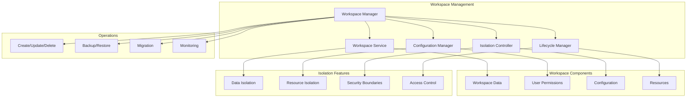

# 🏢 Workspace Module

The workspace module provides comprehensive multi-tenant workspace management with isolation, configuration, and lifecycle management for enterprise-grade multi-project support.

## 🏗️ Architecture



## 📁 Module Structure

```
workspace/
├── __init__.py              # Module exports
├── manager.py              # Workspace management service
└── README.md               # This documentation
```

## 🔧 Core Components

### Workspace Manager (`manager.py`)

Comprehensive workspace management with security and isolation.

```python
from graphrag_api_service.workspace.manager import WorkspaceManager

# Initialize workspace manager
workspace_manager = WorkspaceManager()

# Create workspace with configuration
workspace = await workspace_manager.create_workspace(
    name="AI Research Project",
    description="Research workspace for AI experiments",
    owner_id="user_123",
    config={
        "llm_provider": "ollama",
        "model": "gemma:4b",
        "embedding_model": "nomic-embed-text",
        "max_tokens": 4000,
        "temperature": 0.7,
        "data_retention_days": 90
    }
)

# Get workspace with security validation
workspace = await workspace_manager.get_workspace(
    workspace_id="ws_456",
    user_id="user_123"  # Security check
)

# Update workspace configuration
updated_workspace = await workspace_manager.update_workspace(
    workspace_id="ws_456",
    updates={
        "description": "Updated description",
        "config": {"temperature": 0.8}
    },
    user_id="user_123"
)

# List user workspaces
workspaces = await workspace_manager.list_user_workspaces(
    user_id="user_123",
    status="active",
    limit=20
)
```

**Key Features:**
- **Multi-tenant Isolation**: Complete data and resource isolation between workspaces
- **Flexible Configuration**: Per-workspace LLM and processing settings
- **Access Control**: Role-based permissions and ownership management
- **Resource Management**: Quota enforcement and usage tracking
- **Lifecycle Management**: Creation, archival, and deletion workflows

### Workspace Configuration

```python
from graphrag_api_service.workspace.manager import WorkspaceConfig

# Define workspace configuration schema
workspace_config = WorkspaceConfig(
    # LLM Configuration
    llm_provider="ollama",  # ollama, google_gemini, openai
    llm_model="gemma:4b",
    embedding_model="nomic-embed-text",
    max_tokens=4000,
    temperature=0.7,

    # Processing Configuration
    chunk_size=1200,
    chunk_overlap=100,
    max_gleanings=1,

    # GraphRAG Configuration
    community_report_max_length=2000,
    entity_extraction_max_gleanings=1,
    relationship_extraction_max_gleanings=1,

    # Storage Configuration
    data_retention_days=90,
    max_storage_gb=10,
    enable_versioning=True,

    # Security Configuration
    encryption_enabled=True,
    access_logging=True,
    data_classification="internal"
)

# Validate configuration
validation_result = workspace_config.validate()
if not validation_result.is_valid:
    print(f"Configuration errors: {validation_result.errors}")
```

### Workspace Isolation

```python
class WorkspaceIsolation:
    def __init__(self, workspace_id: str):
        self.workspace_id = workspace_id
        self.base_path = self.get_workspace_path(workspace_id)

    def get_workspace_path(self, workspace_id: str) -> Path:
        """Get secure, isolated workspace path."""
        # Validate workspace ID format
        if not self.is_valid_workspace_id(workspace_id):
            raise ValueError("Invalid workspace ID format")

        # Create isolated directory structure
        base_workspaces = Path(settings.base_workspaces_path)
        workspace_path = base_workspaces / workspace_id

        # Ensure path is within allowed boundaries
        resolved_path = workspace_path.resolve()
        if not str(resolved_path).startswith(str(base_workspaces.resolve())):
            raise SecurityError("Workspace path outside allowed boundaries")

        return workspace_path

    async def create_workspace_structure(self):
        """Create isolated workspace directory structure."""
        workspace_path = self.base_path

        # Create directory structure
        directories = [
            "input",           # Input documents
            "output",          # GraphRAG output
            "cache",           # Workspace-specific cache
            "logs",            # Workspace logs
            "config",          # Configuration files
            "backups"          # Workspace backups
        ]

        for directory in directories:
            (workspace_path / directory).mkdir(parents=True, exist_ok=True)

        # Set appropriate permissions
        await self.set_workspace_permissions(workspace_path)

    async def isolate_resources(self):
        """Ensure resource isolation for workspace."""
        # Database isolation - workspace-specific tables/schemas
        await self.setup_database_isolation()

        # Cache isolation - workspace-specific cache keys
        await self.setup_cache_isolation()

        # File system isolation - workspace-specific directories
        await self.setup_filesystem_isolation()

        # Process isolation - workspace-specific job queues
        await self.setup_process_isolation()
```

### Workspace Lifecycle Management

```python
class WorkspaceLifecycleManager:
    def __init__(self, workspace_manager: WorkspaceManager):
        self.workspace_manager = workspace_manager

    async def create_workspace_lifecycle(self, workspace_data: dict) -> dict:
        """Complete workspace creation lifecycle."""
        workspace_id = None

        try:
            # Phase 1: Create workspace record
            workspace = await self.workspace_manager.create_workspace_record(workspace_data)
            workspace_id = workspace["id"]

            # Phase 2: Create isolated directory structure
            isolation = WorkspaceIsolation(workspace_id)
            await isolation.create_workspace_structure()

            # Phase 3: Initialize workspace configuration
            await self.initialize_workspace_config(workspace_id, workspace_data.get("config", {}))

            # Phase 4: Set up permissions and access control
            await self.setup_workspace_permissions(workspace_id, workspace_data["owner_id"])

            # Phase 5: Initialize monitoring and logging
            await self.setup_workspace_monitoring(workspace_id)

            # Phase 6: Mark workspace as active
            await self.workspace_manager.activate_workspace(workspace_id)

            logger.info(f"Workspace created successfully: {workspace_id}")
            return workspace

        except Exception as e:
            # Cleanup on failure
            if workspace_id:
                await self.cleanup_failed_workspace(workspace_id)

            logger.error(f"Workspace creation failed: {e}")
            raise

    async def archive_workspace(self, workspace_id: str, user_id: str) -> dict:
        """Archive workspace with data preservation."""
        # Verify permissions
        await self.verify_workspace_access(workspace_id, user_id, "admin")

        # Create backup before archiving
        backup_result = await self.create_workspace_backup(workspace_id)

        # Update workspace status
        await self.workspace_manager.update_workspace_status(workspace_id, "archived")

        # Stop workspace services
        await self.stop_workspace_services(workspace_id)

        # Move data to archive storage
        await self.move_to_archive_storage(workspace_id)

        return {
            "workspace_id": workspace_id,
            "status": "archived",
            "backup_id": backup_result["backup_id"],
            "archived_at": datetime.utcnow().isoformat()
        }

    async def delete_workspace(self, workspace_id: str, user_id: str, force: bool = False) -> dict:
        """Permanently delete workspace."""
        # Verify permissions (requires admin or owner)
        await self.verify_workspace_access(workspace_id, user_id, "admin")

        if not force:
            # Create final backup
            backup_result = await self.create_workspace_backup(workspace_id)

        # Stop all workspace services
        await self.stop_workspace_services(workspace_id)

        # Remove workspace data
        await self.remove_workspace_data(workspace_id)

        # Remove database records
        await self.workspace_manager.delete_workspace_record(workspace_id)

        # Clean up permissions and access records
        await self.cleanup_workspace_permissions(workspace_id)

        return {
            "workspace_id": workspace_id,
            "status": "deleted",
            "deleted_at": datetime.utcnow().isoformat(),
            "backup_created": not force
        }
```

## 🔐 Security Features

### Access Control

```python
class WorkspaceAccessControl:
    def __init__(self, workspace_id: str):
        self.workspace_id = workspace_id

    async def check_access(self, user_id: str, permission: str) -> bool:
        """Check if user has specific permission for workspace."""
        # Get user's workspace roles
        user_roles = await self.get_user_workspace_roles(user_id)

        # Check permission against roles
        return self.has_permission(user_roles, permission)

    def has_permission(self, roles: list[str], permission: str) -> bool:
        """Check if roles include required permission."""
        permission_map = {
            "read": ["viewer", "editor", "admin", "owner"],
            "write": ["editor", "admin", "owner"],
            "admin": ["admin", "owner"],
            "delete": ["owner"]
        }

        allowed_roles = permission_map.get(permission, [])
        return any(role in allowed_roles for role in roles)

    async def grant_access(self, user_id: str, role: str, granted_by: str):
        """Grant workspace access to user."""
        # Verify granter has admin permissions
        if not await self.check_access(granted_by, "admin"):
            raise PermissionError("Insufficient permissions to grant access")

        # Add user role
        await self.add_user_role(user_id, role)

        # Log access grant
        await self.log_access_change(
            action="grant",
            user_id=user_id,
            role=role,
            granted_by=granted_by
        )

    async def revoke_access(self, user_id: str, revoked_by: str):
        """Revoke workspace access from user."""
        # Verify revoker has admin permissions
        if not await self.check_access(revoked_by, "admin"):
            raise PermissionError("Insufficient permissions to revoke access")

        # Remove user roles
        await self.remove_user_roles(user_id)

        # Log access revocation
        await self.log_access_change(
            action="revoke",
            user_id=user_id,
            revoked_by=revoked_by
        )
```

### Data Isolation

```python
class WorkspaceDataIsolation:
    def __init__(self, workspace_id: str):
        self.workspace_id = workspace_id

    async def get_isolated_database_session(self):
        """Get database session with workspace isolation."""
        session = await db_manager.get_session()

        # Set workspace context for all queries
        await session.execute(
            "SET @workspace_id = :workspace_id",
            {"workspace_id": self.workspace_id}
        )

        return session

    def get_isolated_cache_key(self, key: str) -> str:
        """Generate workspace-isolated cache key."""
        return f"ws:{self.workspace_id}:{key}"

    def get_isolated_file_path(self, relative_path: str) -> Path:
        """Get workspace-isolated file path."""
        workspace_path = self.get_workspace_path()
        file_path = workspace_path / relative_path

        # Ensure path is within workspace boundaries
        resolved_path = file_path.resolve()
        if not str(resolved_path).startswith(str(workspace_path.resolve())):
            raise SecurityError("File path outside workspace boundaries")

        return resolved_path
```

## 📊 Resource Management

### Quota Management

```python
class WorkspaceQuotaManager:
    def __init__(self, workspace_id: str):
        self.workspace_id = workspace_id

    async def check_storage_quota(self, additional_size_mb: float = 0) -> dict:
        """Check workspace storage quota."""
        current_usage = await self.get_storage_usage()
        quota_limit = await self.get_storage_quota()

        projected_usage = current_usage + additional_size_mb

        return {
            "current_usage_mb": current_usage,
            "quota_limit_mb": quota_limit,
            "projected_usage_mb": projected_usage,
            "available_mb": quota_limit - current_usage,
            "quota_exceeded": projected_usage > quota_limit,
            "usage_percentage": (current_usage / quota_limit) * 100
        }

    async def enforce_quota(self, operation: str, size_mb: float):
        """Enforce quota limits for operations."""
        quota_check = await self.check_storage_quota(size_mb)

        if quota_check["quota_exceeded"]:
            raise QuotaExceededError(
                f"Operation would exceed storage quota. "
                f"Current: {quota_check['current_usage_mb']:.1f}MB, "
                f"Limit: {quota_check['quota_limit_mb']:.1f}MB, "
                f"Requested: {size_mb:.1f}MB"
            )

    async def get_resource_usage(self) -> dict:
        """Get comprehensive resource usage for workspace."""
        return {
            "storage": await self.get_storage_usage(),
            "compute_hours": await self.get_compute_usage(),
            "api_requests": await self.get_api_usage(),
            "indexing_jobs": await self.get_indexing_usage()
        }
```

## 🧪 Testing

### Workspace Testing

```python
import pytest
from graphrag_api_service.workspace.manager import WorkspaceManager

@pytest.fixture
async def workspace_manager():
    return WorkspaceManager()

@pytest.mark.asyncio
async def test_workspace_creation(workspace_manager):
    workspace_data = {
        "name": "Test Workspace",
        "description": "Test workspace for unit tests",
        "owner_id": "test_user_123",
        "config": {
            "llm_provider": "ollama",
            "model": "gemma:4b"
        }
    }

    workspace = await workspace_manager.create_workspace(**workspace_data)

    assert workspace["name"] == "Test Workspace"
    assert workspace["owner_id"] == "test_user_123"
    assert "id" in workspace

@pytest.mark.asyncio
async def test_workspace_isolation(workspace_manager):
    # Create two workspaces
    ws1 = await workspace_manager.create_workspace(
        name="Workspace 1", owner_id="user1"
    )
    ws2 = await workspace_manager.create_workspace(
        name="Workspace 2", owner_id="user2"
    )

    # Verify isolation
    isolation1 = WorkspaceIsolation(ws1["id"])
    isolation2 = WorkspaceIsolation(ws2["id"])

    path1 = isolation1.get_workspace_path(ws1["id"])
    path2 = isolation2.get_workspace_path(ws2["id"])

    # Paths should be different and isolated
    assert path1 != path2
    assert not str(path1).startswith(str(path2))
    assert not str(path2).startswith(str(path1))

@pytest.mark.asyncio
async def test_access_control():
    access_control = WorkspaceAccessControl("test_workspace")

    # Grant access
    await access_control.grant_access("user1", "editor", "admin_user")

    # Check permissions
    assert await access_control.check_access("user1", "read")
    assert await access_control.check_access("user1", "write")
    assert not await access_control.check_access("user1", "admin")

    # Revoke access
    await access_control.revoke_access("user1", "admin_user")
    assert not await access_control.check_access("user1", "read")
```

## 🚨 Best Practices

1. **Isolation First**: Always ensure complete workspace isolation
2. **Security Validation**: Validate all workspace access and operations
3. **Resource Management**: Implement and enforce resource quotas
4. **Audit Logging**: Log all workspace operations and access changes
5. **Backup Strategy**: Regular backups before major operations
6. **Permission Management**: Use principle of least privilege
7. **Configuration Validation**: Validate all workspace configurations
8. **Lifecycle Management**: Proper creation, archival, and deletion workflows
9. **Monitoring**: Track workspace usage and performance
10. **Documentation**: Maintain clear workspace policies and procedures

---

For more information, see the [main documentation](../../../README.md) or other module documentation.
